# PM B 一期 PRD 正式文档

版本：v1.1

更新时间：2026-06-12

负责人角色：PM B，交易基础设施、后台运营与风控

参考文档：

- 本地文档：`一期产品需求概览.md`
- 本地文档：`一期产品经理分工方案.md`
- 本地文档：`调研报告.md`
- 官方资料：Polymarket API Reference，https://docs.polymarket.com/api-reference/introduction
- 官方资料：Predict API Reference，https://dev.predict.fun/

## 版本更新记录

| 版本 | 更新时间 | 更新内容 |
| --- | --- | --- |
| v1.1 | 2026-06-12 | 补充文档版本管理规范，新增版本更新记录表；后续修改本文档时需同步更新版本号、更新时间和变更说明。 |
| v1.0 | 2026-06-09 | 输出 PM B 一期正式 PRD，明确交易底座、后台运营、风控审计、平台接入、标的归组、订单持仓和结算追踪范围。 |

## 1. 文档定位

本文是 PM B 的一期正式 PRD，用于指导研发技术方案、管理后台原型、接口文档、测试用例和上线验收。

本文不展开 Polymarket / Predict.fun 的完整 API 字段定义，而是基于官方 API 的真实能力，反向校验和完善我们的一期产品需求：

- 哪些底层 API 能力必须被产品化。
- 哪些后台页面必须支持运营、审核和排障。
- 哪些状态、异常、风控、监控必须进入一期。
- 哪些能力必须输出给 PM A，支撑快捷交易面板、专业交易面板、订单页、持仓页和自动报单入口。

## 2. 一期边界

### 2.1 一期必须坚持的产品边界

- 产品形态：标的聚合 + 单标的绑定平台交易 + Web3 非托管钱包 + 快捷/专业双交易面板。
- 接入平台：Polymarket、Predict.fun。
- 交易范围：Taker + Maker + 撤单。
- 交易模型：每个 `TradeableInstrument` 绑定唯一 venue、chain、collateralToken、venueMarketId、outcomeId 和订单接口。
- 执行逻辑：用户选中哪个标的，就把订单提交到该标的绑定平台。
- 账户逻辑：EVM 地址是用户唯一 ID；平台不托管资产、不帮用户开设底层平台账户、不做 managed balance。
- 网络逻辑：Polymarket 标的使用 Polygon / USDC；Predict.fun 标的使用 BNB Chain / USDT。
- 展示逻辑：同主题可以归组、相似推荐、合并展示入口，但不合并盘口、不合并深度、不合并成本池。
- 合并展示入口规则：只有跨平台相同事件在赔率、交割时间、结果定义、结算规则、抵押资产口径、可交易状态等影响交易的关键参数全部一致，或经过后台人工审核确认可以合并展示时，前台才允许合并为一个主题入口。
- 合并展示后的交易规则：详情页和下单窗口必须提供 Polymarket / Predict.fun 或具体标的切换 tab，用户下单前必须选中一个具体 `TradeableInstrument`。
- 套利展示规则：同主题存在套利空间时，前台可以展示“可套利”标识；该标识只代表信息提示，不代表自动组合下单或无风险承诺。
- 竞品策略：agg.market 仅作为体验和二期能力参考，一期不接入其执行层、资金系统或跨场所路由能力。

### 2.2 一期明确不做

- 不做 Polymarket Bridge / Relayer。
- 不做跨链资金调度。
- 不做自动换币、rebalance、代付 Gas。
- 不做托管账户、充值、提现、managed balance。
- 不做聚合订单簿。
- 不做跨平台拆单。
- 不做智能最优路由。
- 不做同一 Maker 订单多平台复制挂单。
- 不承诺套利提示是无风险收益。

## 3. PM B 与 PM A 的依赖关系

PM B 的核心责任不是“后台页面”，而是为 PM A 的前台体验提供可执行、可追踪、可风控的数据和交易底座。

| PM A 场景 | PM B 必须提供 | 对齐要求 |
| --- | --- | --- |
| 首页 / 标的列表 | 标准化标的、价格概率、流动性、成交量、到期时间、状态、分类、搜索结果 | 前台不直连第三方 API，只使用 PM B 标准化数据 |
| 标的详情页 | 单标的盘口、成交历史、结算规则、同主题标的、平台/标的切换、套利空间提示 | 盘口只展示当前标的，不合并两个平台深度 |
| 最优赔率高亮 | 含手续费、滑点、链上成本后的到手收益测算和默认预选标的 | 只做单标的预选，不做跨平台拆单或智能路由 |
| 快捷交易面板 | Quote、预计份额、最大亏损、成立后可得、到手收益、quote 有效期、余额/授权/切链/签名状态 | quote 过期、网络错误、授权不足时阻止确认 |
| 专业交易面板 | Market/Limit、价格、数量、订单有效期、当前委托、撤单状态、成交历史 | Maker/Taker 都只提交到当前标的绑定平台 |
| 自动报单 Banner | 推荐机会、推荐分、推荐文案、推荐价格、有效期、风险文案、上下架状态 | 行情 stale、流动性下降、API 异常时自动下架 |
| 套利空间提示 | 同主题标的、Yes/No 方向、最优价格、成本测算、有效期、失效条件 | 一期只提示，不组合下单、不拆单 |
| 订单页 | 聚合订单号、底层订单 ID/hash、状态、失败原因、撤单状态 | 列表弱化平台，详情必须可追溯底层平台 |
| 持仓页 | 按 EVM 地址查询持仓、EventGroup 归组、单标的来源、成本、份额、结算状态、浮动盈亏 | 同主题可归组，但不能合并成本池；必须能展开具体平台持仓明细 |
| 结算追踪 | 事件结算状态、持仓结算状态、结算后仓位更新、通知触发条件 | 支撑 PM A 的结算追踪和推送通知 |
| 埋点报表 | DAU、下单次数、下单成功率、GMV、平台订单分布、模式使用比例、API 故障、订单失败率 | 支撑 PM A 的业务指标和护栏指标 |

## 4. 官方 API 对 PRD 的校验结论

### 4.1 Polymarket API 对产品需求的影响

Polymarket 官方 API 分为 Gamma API、Data API、CLOB API。产品需求必须按用途拆开，不能用一个“Polymarket API”笼统描述。

| API 能力 | 产品用途 | PM B 需求补充 |
| --- | --- | --- |
| Gamma API | 市场发现、事件、市场、标签、系列、搜索、公开资料 | 市场同步、分类、搜索、EventGroup 候选、结算规则入口优先从 Gamma 获取 |
| Data API | 用户持仓、交易、活动、持有人、open interest、分析数据 | 持仓页、成交记录、用户历史活动、流动性和热度辅助指标 |
| CLOB API | 订单簿、价格、midpoint、spread、历史价格、下单、撤单、订单管理 | 专业盘口、quote、Taker、Maker、撤单、订单状态、交易失败原因 |
| CLOB 认证 | 交易接口需要认证 | 后台需管理 CLOB 凭证状态、签名链路、订单提交失败、撤单失败 |
| WebSocket Market/User | 行情和用户订单状态实时更新 | 行情新鲜度、断线重连、心跳、降级轮询、stale 标记 |
| Bridge API | 存取款/桥接 | 一期不接入，不能出现在一期资金能力中 |

产品要求：

- Polymarket 市场发现与展示不等于可交易。只有能映射到 CLOB token、订单簿可用、状态可交易的市场，才能成为可交易 `TradeableInstrument`。
- Gamma 的价格可用于列表摘要，但下单前 quote 必须以 CLOB 当前订单簿/价格为准。
- Data API 与 CLOB 订单/交易数据可能存在时延差异，订单、成交、持仓同步必须设计一致性校验和刷新策略。
- CLOB 交易认证、签名、funder address、API 凭证、订单 hash、撤单回执必须被记录进审计日志。

### 4.2 Predict.fun API 对产品需求的影响

Predict.fun 官方 API 当前为 Beta，模块覆盖 Categories、Markets、Orders、Accounts、Positions、Search、Authorization、WebSocket、OAuth 等。产品需求应映射为产品模块，不写成接口字段字典。

| API 能力 | 产品用途 | PM B 需求补充 |
| --- | --- | --- |
| Categories / Tags | 分类、标签、发现入口 | 标的列表分类、自动报单候选池、搜索筛选 |
| Markets / Search | 市场列表、市场详情、统计、搜索 | 市场同步、标的详情、EventGroup 候选、推荐候选池 |
| Market Orderbook | 单市场盘口 | 专业面板盘口、quote、行情新鲜度、套利提示基础价格 |
| Orders | 获取订单、创建订单、移除订单、match events | Taker/Maker/撤单、订单状态、成交事件同步 |
| Positions | 用户持仓、按地址持仓 | 持仓页、持仓归组、结算状态 |
| Authorization / JWT | 私有接口认证 | JWT 获取、过期、刷新失败、认证失败状态 |
| API Key | 主网 API 请求 | 后台需管理 API Key 状态、频控、403/429 告警 |
| WebSocket | 行情、订阅、心跳 | 实时行情、心跳失败、断线重连、降级轮询 |
| Smart Wallet / Predict Account | 官方 Web App 账户路径 | 一期默认 EOA 钱包路径；Smart Wallet 作为待确认或二期能力 |

产品要求：

- Predict.fun Mainnet API Key、JWT 过期、接口 Beta 变更必须进入后台监控和上线准备清单。
- Predict.fun orderbook 以 Yes outcome 为基准，No 侧价格需要转换和精度校验；否则快捷面板的概率、最大亏损和收益文案会误导用户。
- Predict.fun 支持 EOA 和 Smart Wallet / Predict Account。一期默认 EOA，避免引入私钥导出、托管账户或复杂账户抽象。
- OAuth 相关接口不作为一期默认交易路径，除非后续确认业务必须支持 Predict Account。

## 5. 产品架构与数据流

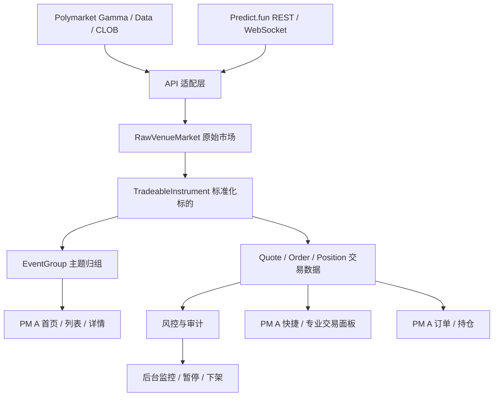

核心原则：

- 前台不直连第三方 API。
- 第三方 API 差异全部收敛在 PM B 的 API 适配层。
- 标准化数据向前台输出，底层 venue 信息向订单详情、后台和审计保留。
- 行情、quote、订单、持仓都必须带更新时间和数据来源。

## 6. 核心数据对象

本节定义产品对象，不是第三方 API 字段表。

### 6.1 RawVenueMarket

用途：保存底层平台原始市场，支撑同步、排查、归组审核和可交易判断。

关键产品字段：

- venue（底层平台）：Polymarket 或 Predict.fun。
- apiSource（API 来源）：该数据来自 Gamma、Data、CLOB、Markets、Orders、Positions、WebSocket 等哪类接口。
- venueEventId（底层事件 ID）：底层平台自己的事件编号。
- venueMarketId（底层市场 ID）：底层平台自己的市场或交易市场编号。
- rawTitle（原始标题）：底层平台返回的原始市场标题。
- rawDescription（原始描述）：底层平台返回的原始说明文案。
- rawStatus（原始状态）：底层平台返回的市场状态，如 open、closed、resolved 等。
- rawCategory（原始分类）：底层平台返回的分类。
- rawTags（原始标签）：底层平台返回的标签。
- sourceUrl（原始链接）：底层平台市场详情页 URL。
- endTime（结束时间）：市场停止交易或进入结算的时间。
- resolutionRulesUrl（结算规则链接）：底层平台或原始市场的结算规则入口。
- lastSyncAt（最近同步时间）：系统最后一次成功或失败同步该数据的时间。
- syncStatus（同步状态）：成功、失败、延迟、频控、认证失败等。
- lastError（最近错误）：最近一次同步或解析失败原因。
- tradableCandidate（可交易候选）：是否进入标准化标的候选池。

### 6.2 TradeableInstrument

用途：一期真实可交易最小单元。

关键产品字段：

- instrumentId（聚合标的 ID）：我们平台内部的可交易标的唯一编号。
- eventGroupId（同主题 ID）：所属 `EventGroup` 编号，用于同主题展示归组。
- venue（底层平台）：该标的绑定的真实交易平台。
- chainId（交易链 ID）：Polygon、BNB Chain 等 EVM 链编号。
- collateralToken（结算资产）：USDC、USDT 等实际支付和结算资产。
- venueMarketId（底层市场 ID）：底层平台市场编号。
- outcomeId（底层选项 ID）：Yes、No 或底层平台 outcome token 对应编号。该字段是下单和映射使用的底层标识，不代表事件已结算或已经开奖。
- outcomeName（结果名称）：前台展示的结果名称，如 Yes、No、涨、跌、会、不会。
- clobTokenOrTokenId（订单簿 token ID）：Polymarket CLOB token 或 Predict.fun 对应 token / outcome 标识。
- title（标准化标题）：我们平台展示的标的标题。
- description（标准化描述）：我们平台展示的标的说明。
- resolutionRules（结算规则）：用户判断事件如何结算的规则摘要。
- price（当前价格）：当前标的最新可参考价格。
- probability（隐含概率）：由价格换算后的概率展示。
- liquidity（流动性）：当前标的可交易深度或平台返回流动性指标。
- volume（成交量）：近期或累计成交量。
- endTime（到期/停止交易时间）：用户可交易或事件结束时间。
- orderInterfaceType（订单接口类型）：CLOB、REST order、SDK order 等实际执行接口。
- tradableStatus（可交易状态）：可交易、仅展示、暂停、关闭、已结算、API 异常等。
- marketDataFreshness（行情新鲜度）：行情是否实时、延迟或 stale。
- lastPriceUpdateAt（最近价格更新时间）：最新价格或盘口更新时间。

可交易判断：

- 底层市场状态可交易。
- outcome 映射完整。
- 当前平台 API 健康。
- 当前标的有可用盘口或可用下单接口。
- 结算规则清晰。
- 未进入异常结算窗口。
- 未命中地区、平台、标的或流动性风控。

### 6.3 EventGroup

用途：同主题展示归组，不代表盘口合并。

同主题/事件合并展示规则：跨平台相同事件只有在赔率相同、交割时间相同、结果定义相同、结算规则相同、交易状态一致，且除标题介绍文案外影响交易的关键参数全部一致时，才允许在聚合平台合并展示入口；否则只能做同主题归组或相似推荐。合并展示后，详情页和下单窗口必须提供两个平台或具体标的的切换 tab；存在套利空间时展示“可套利”标识。

关键产品字段：

- eventGroupId（同主题 ID）：同一预测主题的内部编号。
- title（主题标题）：归组后的统一展示标题。
- category（主题分类）：政治、体育、加密、宏观等分类。
- instrumentIds（包含标的）：该主题下包含的 `TradeableInstrument` 列表。
- matchRate（匹配度）：AI/规则判断为同主题的匹配程度。后台展示统一使用“匹配度”，避免使用“置信度”等偏算法词。
- matchReason（匹配理由）：为什么认为这些标的是同主题。
- differenceSummary（差异摘要）：标题、交割时间、结算规则、赔率等差异说明。
- reviewStatus（审核状态）：候选、待审核、已确认、已拒绝、已暂停。
- reviewer（审核人）：最后一次人工审核的操作人。
- reviewedAt（审核时间）：最后一次人工审核时间。

规则：

- 同主题归组只用于展示、搜索、相似推荐、持仓归组和套利提示。
- `EventGroup` 不得作为交易对象。
- 用户下单前必须选择具体 `TradeableInstrument`。

### 6.4 Quote

用途：下单前询价和交易确认。

关键产品字段：

- quoteId（询价 ID）：一次下单前报价的唯一编号。
- evmAddress（钱包地址）：用户 EVM 钱包地址。
- instrumentId（聚合标的 ID）：本次询价对应的真实可交易标的。
- venue（底层平台）：本次询价对应的交易平台。
- chainId（交易链 ID）：本次询价需要使用的链。
- collateralToken（结算资产）：本次询价使用的 USDC、USDT 等资产。
- side（交易方向）：买入/卖出。
- outcomeSide（买卖结果）：YES / NO。后台和前台展示时应组合为“买入 YES”“买入 NO”“卖出 YES”等用户可理解文案。
- orderType（订单类型）：Market / Limit。
- inputAmount（投入金额）：用户计划投入的金额。
- estimatedShares（预计获得份额）：按当前 quote 预计可获得的 outcome 份额。
- estimatedAveragePrice（预计均价）：考虑盘口后的预计成交均价。
- maxSlippageBps（最大滑点）：用户允许的最大价格偏离。
- feeEstimate（费用预估）：平台费、链上成本或其他预计费用。
- netPayoutEstimate（预计到手收益）：扣除费用后的预计到手金额或成功后可获得金额。
- priceVersion（价格版本）：生成 quote 时使用的行情版本。
- source（报价来源）：CLOB、Predict orderbook、缓存快照等。
- createdAt（创建时间）：quote 生成时间。
- expiresAt（过期时间）：quote 失效时间。
- quoteStatus（询价状态）：已创建、已接受、已过期、stale、已拒绝。
- staleReason（过期/失效原因）：行情过期、盘口不可用、流动性不足等。

规则：

- 快捷交易、专业 Market 交易、自动报单都必须基于 quote。
- quote 过期后确认按钮失效。
- quote 与提交订单之间必须重新校验行情新鲜度、余额、授权和风控。

### 6.5 SingleVenueOrder

用途：一期聚合平台订单。每笔只映射一个底层平台订单。

关键产品字段：

- orderId（聚合订单号）：我们平台生成的订单唯一编号。
- quoteId（询价 ID）：订单来源 quote。
- evmAddress（钱包地址）：下单用户钱包地址。
- instrumentId（聚合标的 ID）：订单对应的真实可交易标的。
- eventName（事件名称）：用户下单时看到的事件标题，例如“世界杯冠军”。
- optionName（选项）：用户选择的具体选项，例如“西班牙”“法国”。
- eventGroupId（同主题 ID）：订单所属主题，用于订单归组展示。
- venue（底层平台）：订单实际提交的平台。
- chainId（交易链 ID）：订单实际使用的链。
- collateralToken（结算资产）：订单实际使用的资产。
- venueOrderId（底层订单 ID）：底层平台返回的订单编号。
- orderHash（订单哈希）：底层订单或签名订单的 hash。
- txHash（链上交易哈希）：如有链上交易回执则记录。
- signatureHash（签名哈希）：用户签名或签名摘要。
- orderType（订单类型）：Market / Limit。
- side（交易方向）：买入/卖出。
- outcomeSide（买卖结果）：YES / NO。
- price（订单价格）：订单提交价格。
- size（订单数量）：订单份额数量。
- amount（订单金额）：订单投入或成交金额。
- status（订单状态）：已提交、部分成交、完全成交、撤单中、已撤单、失败等。
- filledSize（已成交数量）：已经成交的份额。
- averageFillPrice（成交均价）：已成交部分的平均价格。
- apiSubmitStatus（API 提交状态）：提交到底层平台 API 的结果。
- cancelStatus（撤单状态）：撤单请求、撤单成功、撤单失败等。
- authStatus（认证状态）：CLOB 凭证、API Key、JWT、签名认证等状态。
- failureReason（失败原因）：用户可读和研发可排查的失败原因。
- createdAt（创建时间）：订单创建时间。
- updatedAt（更新时间）：订单最近一次状态更新时间。

规则：

- 聚合订单号由我们平台生成。
- venue order 由底层平台生成或映射。
- 一个聚合订单只允许存在一个 venue order。
- 撤单只撤该订单绑定的底层 venue order。

### 6.6 Position

用途：用户持仓展示和后台查询。

关键产品字段：

- evmAddress（钱包地址）：持仓所属用户。
- eventGroupId（同主题 ID）：持仓所属主题，用于归组展示。
- instrumentId（聚合标的 ID）：持仓对应的真实可交易标的。
- eventName（事件名称）：持仓对应的事件标题。
- optionName（选项）：持仓对应的具体选项。
- venue（底层平台）：持仓来源平台。
- chainId（交易链 ID）：持仓所在链。
- collateralToken（结算资产）：持仓计价和结算资产。
- outcomeId（底层选项 ID）：持仓对应的底层选项标识，不代表最终开奖结果。
- side（持仓方向）：买入/卖出。
- outcomeSide（持仓结果）：YES / NO，用于展示用户实际持有的是哪一侧。
- shares（持仓份额）：用户持有的 outcome 份额。
- averageCost（平均成本）：该单标的持仓平均成本。
- currentPrice（当前价格）：该持仓当前参考价格。
- unrealizedPnl（浮动盈亏）：按当前价格估算的未实现盈亏。
- settlementStatus（结算状态）：未结算、结算中、已赢、已输、异常等。
- settlementAmount（结算金额）：事件结算后预计或实际可领取金额。
- lastSyncAt（最近同步时间）：持仓最近一次同步时间。

规则：

- 可以按 `EventGroup` 展示归组。
- 不合并跨平台成本池。
- 不展示为跨平台净头寸。

### 6.7 AutoOrderOpportunity

用途：AI 自动报单机会。

关键产品字段：

- opportunityId（自动报单机会 ID）：推荐机会唯一编号。
- instrumentId（聚合标的 ID）：推荐对应的真实可交易标的。
- eventGroupId（同主题 ID）：推荐所属主题。
- venue（底层平台）：推荐机会实际交易平台。
- chainId（交易链 ID）：推荐机会需要使用的链。
- collateralToken（结算资产）：推荐机会使用资产。
- recommendedOutcome（推荐方向）：推荐买 Yes、买 No 或其他结果。
- recommendedPrice（推荐价格）：推荐展示和快捷下单使用价格。
- probability（隐含概率）：推荐价格对应概率。
- liquidity（流动性）：推荐标的当前流动性。
- volume（成交量）：推荐标的成交量或热度指标。
- endTime（到期时间）：标的结束或停止交易时间。
- copy（推荐文案）：前台 Banner / 卡片展示文案。
- riskCopy（风险文案）：最大亏损、结算条件、非收益承诺等风险提示。
- score（推荐分）：综合热度、流动性、赔率可读性等得到的分数。
- marketFreshness（行情新鲜度）：推荐依据的行情是否有效。
- quoteExpiresAt（报价过期时间）：推荐价格或快捷 quote 的有效期。
- status（推荐状态）：候选、待审核、上线、暂停、下架、过期。
- delistReason（下架原因）：quote stale、低流动性、API 异常、人工下架等。
- reviewer（审核人）：文案或推荐审核人。
- createdAt（创建时间）：推荐机会创建时间。
- updatedAt（更新时间）：推荐机会最近更新时间。

规则：

- 只推荐热门、高流动性、规则清晰、API 可交易、未临近异常结算的标的。
- 推荐上线前可要求运营审核文案。
- 行情 stale、流动性下降、API 异常、标的暂停、结算窗口异常时自动下架。

## 7. 功能需求

### 7.1 API 适配层

目标：将 Polymarket 与 Predict.fun 的 API 差异转为统一产品能力。

P0 能力：

- 独立接入 Polymarket Gamma、Data、CLOB。
- 独立接入 Predict.fun Categories、Markets、Orders、Positions、Authorization、WebSocket。
- 维护每个平台的 API 健康状态、限流状态、认证状态、最近错误。
- 对前台输出统一标准化接口，不让 PM A 处理第三方差异。
- 支持平台级熔断：单个平台异常只影响该平台标的，不影响另一个平台。
- 支持 API 请求失败自动重试 3 次，采用指数退避；3 次失败后进入降级展示或平台/标的熔断。
- 为 PM A 输出“可用平台列表”和“不可用平台原因”，支持单平台故障时另一平台正常展示和交易。

验收：

- 后台能看到每个平台、每类 API 的最近同步时间、成功率、错误率和失败原因。
- 前台所有标的、quote、订单、持仓数据都来自 PM B 标准化服务。
- API 异常被映射为用户可理解的前台提示和后台可排查的错误原因。
- 单平台 API 故障时，对应平台赔率区展示不可用，另一平台不受影响；全平台故障时输出整页降级状态。

### 7.2 市场同步与标准化

P0 能力：

- 同步 Polymarket 事件、市场、标签、系列、搜索相关发现数据。
- 同步 Predict.fun 分类、标签、市场、搜索相关发现数据。
- 同步每个市场的状态、结算信息、结束时间、流动性、成交量、价格摘要。
- 将可交易市场转换为 `TradeableInstrument`。
- 对 Polymarket 市场校验 CLOB token / orderbook 可用性。
- 对 Predict.fun 市场校验 outcome/side 方向、Yes/No 价格转换、交易状态。
- 输出同主题标的的“最优赔率”和“到手收益”候选，用于 PM A 在列表页和详情页高亮。
- 支持在同主题、可比较标的之间预选一个默认交易标的；该预选只影响前台默认 tab，不改变单标的绑定交易模型。

后台操作：

- 查看原始市场。
- 查看标准化标的。
- 手动暂停 / 恢复标的展示。
- 手动标记“规则不清”“低流动性”“API 异常”“不进入推荐池”。

验收：

- 两个平台同步互不影响。
- 不可交易或数据异常的标的不会进入快捷交易或自动报单。
- 标准化标的可以准确支撑 PM A 的列表、详情、搜索、分类和推荐。

### 7.3 事件归组审核

P0 能力：

- 使用文本相似度 / AI 生成 `EventGroup` 候选。
- 比较标题、主体、结果定义、结算时间、结算规则、市场状态。
- 匹配度达到归组阈值且关键参数一致的标的进入“高匹配建议归组”；匹配度不足或关键参数存在差异的标的不进入归组待确认列表。
- 支持确认归组、拒绝归组；拒绝后该候选不生成 `EventGroup`，后续仍作为独立标的展示。
- 支持后台配置归组和合并展示规则：运营可以勾选必须完全一致的关键字段，例如赔率、交割时间、结果定义、结算规则、交易状态、抵押资产口径。
- 支持后台配置匹配度阈值：高于允许归组阈值且关键参数一致时进入“高匹配建议归组”；低于阈值或关键参数冲突时不进入待确认列表。
- 根据规则算法判断两平台交易参数完全相同的标的，可以自动合并事件展示入口；但交易前仍必须选中具体平台 tab。

后台操作：

- 查看两个或多个候选标的的原始信息对比。
- 查看 AI 归组理由、匹配度、差异点。
- 查看归组影响的前台展示位置。
- 对高匹配候选进行确认或拒绝，拒绝后记录拒绝原因和规则版本。
- 配置归组字段一致性规则和允许归组阈值。

验收：

- 错误归组不会导致盘口合并或订单路由错误。
- PM A 可以使用 `EventGroup` 做同主题展示和持仓归组。
- 按同主题/事件展示持仓归组后，必须可以展开查看具体平台、链、资产、标的、结果、份额、成本、浮动盈亏和结算状态。
- 拒绝归组后，前台不再将对应标的作为同主题推荐。

### 7.4 行情、Quote 与实时性

P0 能力：

- 获取 Polymarket CLOB price、midpoint、spread、orderbook。
- 获取 Predict.fun market orderbook、market stats、last sale、timeseries。
- 支持 WebSocket 行情订阅和心跳监控。
- WebSocket 断连后自动重连；持续失败时降级轮询。
- 标记行情 stale，并阻止 quote 或自动报单继续使用过期价格。

Quote 规则：

- quote 必须有有效期。
- quote 必须绑定 instrumentId、venue、chainId、asset 和价格版本。
- quote 过期、行情 stale、盘口不可用、流动性不足时禁止提交订单。
- 自动报单和套利空间提示必须使用有效 quote 或有效行情快照。

验收：

- PM A 快捷面板能展示 quote 有效期、预计获得、最大亏损。
- PM A 专业面板能展示当前标的盘口与成交历史。
- 行情过期（stale）时，自动报单和套利提示自动下架或隐藏。

### 7.5 钱包、网络、授权与认证

P0 能力：

- 支持所有符合 EVM provider 注入或 WalletConnect 类连接方式的 Web3 钱包，包括 GemW 内置钱包和外部注入式钱包。
- EVM 地址作为用户唯一 ID。
- Polymarket 标的下单前请求切换 Polygon。
- Predict.fun 标的下单前请求切换 BNB Chain。
- 检查 Polymarket USDC 余额和授权状态。
- 检查 Predict.fun USDT 余额和授权状态。
- 处理用户拒绝切链、未添加链、资产不足、授权不足、签名失败。
- 用户私钥只在用户钱包侧保存和签名，GemW 服务器不接触、不存储、不代管用户私钥。
- 支持钱包本地完成 EIP-712 签名，由 GemW 后端提交签名后的订单到对应底层平台 API。

平台认证要求：

- Polymarket：CLOB 交易接口需要认证，后台需记录凭证状态、签名状态、订单提交认证失败。
- Predict.fun：主网 API Key、JWT、认证失败、JWT 过期、接口 Beta 变更必须进入监控。
- Predict.fun Smart Wallet / Predict Account 不作为一期默认路径；一期默认 EOA 钱包。

验收：

- 钱包未连接不能下单。
- 网络不匹配时先触发切链。
- 切链失败、授权不足、余额不足、认证失败时不提交真实订单。
- 前台提示和后台错误原因一致。
- 任意支持注入连接和 EVM 签名的 Web3 钱包，都应按同一套钱包状态模型输出给 PM A。

### 7.6 单平台交易执行

P0 能力：

- 在当前 `TradeableInstrument` 上发起 Taker / Market。
- 在当前 `TradeableInstrument` 上发起 Maker / Limit。
- 支持撤单。
- 订单提交前进行 quote、行情、余额、授权、签名、地区、平台健康和标的状态检查。
- 订单提交后映射底层 venue order。
- 记录 orderHash、txHash、signatureHash、失败原因。

执行约束：

- 点击 Polymarket 标的，只走 Polymarket / Polygon / USDC / CLOB。
- 点击 Predict.fun 标的，只走 Predict.fun / BNB Chain / USDT。
- Maker 不复制到另一个平台。
- Taker 不跨平台拆单。
- 系统不自动替用户选择其他平台。

验收：

- Taker 成功、失败、处理中、部分成交、完全成交状态可追踪。
- Maker 成功、部分成交、完全成交、撤单中、已撤单、撤单失败状态可追踪。
- CLOB / Predict 的订单提交失败、撤单失败、认证失败、频控命中都有后台可查原因。

### 7.7 订单、成交、持仓同步

P0 能力：

- 按 EVM 地址查询 Polymarket 订单、交易、持仓。
- 按 EVM 地址查询 Predict.fun 订单、match events、持仓。
- 对 Polymarket 的 CLOB 与 Data API 数据做一致性校验。
- 对 Predict.fun 的 Orders、Match Events、Positions 做同步和回放。
- 将底层状态映射为统一订单状态。

同步策略：

- 下单后优先展示本地聚合订单状态。
- 定时拉取底层订单状态。
- WebSocket 可用时使用实时更新。
- 数据冲突时保留底层原始状态和最后更新时间。
- 成交和持仓允许有刷新延迟，但必须向前台标记“同步中”或“待确认”。

验收：

- PM A 订单页能展示当前委托、历史订单、成交记录、失败订单。
- PM A 持仓页能按同主题归组展示，但单标的来源清晰。
- PM A 持仓页在同主题归组后，可以展开查看每个平台的持仓明细。
- 后台可以按 EVM 地址、订单号、底层订单 ID、hash 查询完整链路。

### 7.8 AI 自动报单

P0 能力：

- 从两个平台中筛选热门、高流动性、规则清晰、未临近异常结算、API 可交易的标的。
- 生成推荐分、推荐理由、推荐价格、推荐方向、文案、风险提示。
- 支持运营审核、上线、下架、排序、风险暂停。
- 支持异常自动下架。

推荐条件：

- 市场状态可交易。
- 盘口或 quote 新鲜。
- 流动性达到阈值。
- 成交量/热度达到阈值。
- 结算规则明确。
- 距离到期时间满足阈值。
- 没有命中地区、平台、标的风控。

自动下架条件：

- quote stale。
- orderbook stale。
- WebSocket 心跳失败且轮询也失败。
- 流动性下降到阈值以下。
- 标的进入异常结算窗口。
- 平台 API 异常或频控严重。
- 运营手动下架或风险暂停。

验收：

- 自动报单 Banner 能从后台 live 状态生成。
- 下架原因能同步给 PM A，用于隐藏入口或展示不可交易提示。
- 自动报单不绕过 quote、钱包、授权、签名和风控检查。

### 7.9 套利空间提示

P0 能力：

- 基于 `EventGroup` 内同主题不同标的识别价格组合机会。
- 当最优 Yes + 最优 No 小于 1.00 且扣除手续费、滑点和链上成本后仍可能成立时，输出提示。
- 显示涉及的两个具体 `TradeableInstrument`、方向、价格、有效期和失效条件。

约束：

- 一期只做信息提示。
- 不自动组合下单。
- 不跨平台拆单。
- 不承诺无风险收益。
- 任一标的不可交易、价格过期、流动性不足、平台 API 异常时提示消失。

验收：

- PM A 可以在专业模式或详情页展示套利空间提示。
- 用户点击后仍需分别选择具体标的交易。

### 7.10 风控与审计

P0 风控：

- 地区限制。
- 服务条款确认。
- 标的交易门禁。
- 平台 API 熔断。
- API Key / JWT / CLOB 凭证异常。
- 频控命中。
- quote stale。
- orderbook stale。
- 流动性不足。
- 余额不足。
- 授权不足。
- 切链失败。
- 签名失败。
- 订单提交失败。
- 撤单失败。
- 自动报单异常下架。

审计要求：

- 记录 EVM 地址。
- 记录 IP 与地区判断。
- 记录 instrumentId、eventGroupId、venue、chainId、collateralToken。
- 记录 quote、签名、提交、撤单、成交、失败链路。
- 记录底层订单 ID、orderHash、txHash、signatureHash。
- 记录操作来源：前台用户、后台运营、系统自动。

验收：

- 风控命中时不会提交真实订单。
- 每笔下单、撤单、失败、后台暂停和自动下架都有审计记录。

### 7.11 结算追踪与通知

P0 能力：

- 同步 Polymarket 和 Predict.fun 的事件结算状态。
- 将底层结算状态映射为统一状态：未结算、结算中、已赢、已输、异常、待人工确认。
- 结算后刷新用户持仓、结算金额、可领取状态和历史记录。
- 支持按 EVM 地址、`eventGroupId`、`instrumentId` 查询结算结果。
- 每条结算记录必须有独立 settlementId。settlementId 不是订单号，而是订单成交形成持仓后，在事件到期或完成结算时产生的结果记录。
- 结算详情必须展示关联订单号、关联标的、用户持仓结果、事件最终结果、结算金额、盈亏和底层平台来源。
- 支持向 PM A 输出通知触发条件：事件已结算、持仓已赢、持仓已输、结算异常、数据同步中。

后台操作：

- 查看待结算、结算中、已结算、结算异常事件。
- 手动刷新底层结算状态。
- 标记结算异常并暂停相关自动报单或交易入口。
- 查看某个用户持仓的结算来源订单和底层平台明细。
- 发送结算通知：仅在结算结果可信时触发，用于通知用户可领取、已赢、已输或结算完成；结算异常时不得发送收益或领取类通知，应先进入人工复核。

验收：

- PM A 持仓页可以展示活跃仓位、当前浮动盈亏和结算状态。
- 事件结算后，PM A 可以获得更新后的持仓状态和通知触发信号。
- 结算异常不会被错误展示为已完成收益。

### 7.12 埋点报表与系统护栏

P0 能力：

- 为 PM A 输出业务报表数据：日 DAU、日下单次数、下单成功率、GMV、按平台分布订单、简洁模式 vs 专业模式使用比例。
- 为 PM A 输出故障报表数据：API 故障频次与时长、订单失败率、签名失败率、切链失败率、quote 过期率。
- 支持订单漏斗埋点：进入列表、进入详情、生成 quote、点击确认、签名成功/失败、提交成功/失败、成交、撤单。
- 支持系统护栏指标：GemW 主页加载因聚合器嵌入增加不超过 200ms、聚合器页面可用率不低于 99%、订单签名失败率不高于 1%。
- 支持指标按 venue、chainId、入口来源、简洁/专业模式、自动报单入口、套利提示入口拆分。

后台操作：

- 查看交易与增长仪表盘。
- 查看 API 故障频次和时长。
- 查看签名失败、订单失败、撤单失败 Top 原因。
- 按平台、链、模式、入口筛选数据。

验收：

- PM A 数据需求中的核心报表可以由 PM B 数据对象和埋点事件支撑。
- 护栏指标异常时可以定位到平台、接口、钱包、网络、订单状态或前台入口。

## 8. 状态机

### 8.1 API 健康状态

- healthy：正常。
- degraded：延迟升高或局部失败。
- rate_limited：命中频控。
- auth_failed：认证失败。
- websocket_down：WebSocket 异常。
- paused：人工暂停。
- outage：不可用。

### 8.2 标的状态

- tradable：可交易。
- view_only：仅展示。
- paused：人工暂停。
- low_liquidity：低流动性。
- stale_market：行情过期。
- closed：已关闭。
- resolved：已结算。
- api_error：平台 API 异常。

### 8.3 Quote 状态

- created：已创建。
- accepted：用户已确认。
- expired：已过期。
- stale：行情过期。
- rejected：风控或参数拒绝。

### 8.4 订单状态

- quoted：已询价。
- network_switching：切链中。
- approval_required：需授权。
- signing：签名中。
- submitting：提交中。
- submitted：已提交。
- partially_filled：部分成交。
- filled：完全成交。
- cancel_requested：撤单请求中。
- cancelled：已撤单。
- failed：失败。
- expired：过期。

### 8.5 自动报单状态

- candidate：候选。
- reviewing：待审核。
- live：上线。
- paused：风险暂停。
- delisted：已下架。
- expired：过期。

### 8.6 结算状态

- unresolved：未结算。
- resolving：结算中。
- won：用户持仓胜出。
- lost：用户持仓失败。
- claimable：可领取或可确认收益。
- settled：已完成结算。
- settlement_error：结算异常。

## 9. 管理后台原型

本节为低保真原型，用于 PRD 评审和后台功能补充。正式视觉和交互稿可由设计阶段继续细化。

### 9.0 后台通用交互规则

- 所有业务列表默认只展示列表和筛选控件，不在列表页右侧常驻展示某一条记录的详情，避免表格和详情互相挤压。
- 列表行操作必须区分“查看型动作”和“执行型动作”。查看型动作，例如详情、日志、失败订单、审计记录，点击后打开弹窗、抽屉或独立详情页；执行型动作，例如立即检测、手动重试、同步该来源、手动重连，点击后直接提交任务并给出 toast 反馈。
- 执行型动作必须在按钮文案上表达清楚动作对象和结果，不允许所有按钮都进入同一个泛化详情弹窗。
- 可回滚且影响范围在当前行已经明确的动作，可以在列表层直接触发并写入审计，例如手动重试、暂停下单、同步该来源、手动重连。不可逆、批量确认、影响范围不清晰或需要填写原因的动作，仍需进入详情页或确认弹窗。
- 所有核心列表必须支持关键词搜索，并至少支持一个关键下拉筛选，例如状态、平台、类型、交易状态、结算状态、认证状态或风险状态。
- 详情弹窗或详情页必须支持内部滚动，长字段、长文案、长表格不能撑破主页面布局。

### 9.1 后台总览

目标：作为 PM B 管理后台的轻量看板，只展示健康摘要、待处理数量、关键经营指标和异常入口，不承载 API 暂停/恢复、日志、重试、WebSocket 重连等重操作。

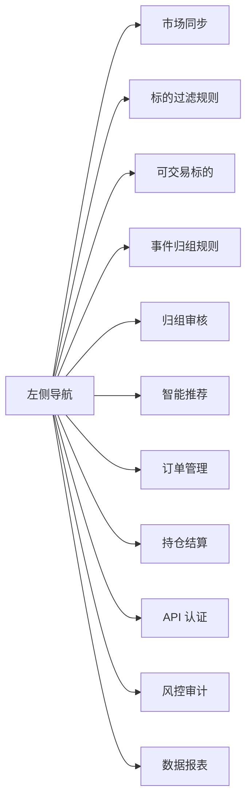

总览页展示要求：

| 区域 | 展示内容 | 操作边界 |
| --- | --- | --- |
| 顶部状态条 | Polymarket API、Predict.fun API、WebSocket 心跳、Quote 过期、订单失败率、签名失败率 | 只读摘要，点击可跳转对应管理页 |
| 核心指标 | 今日 GMV、下单成功率、活跃标的、高匹配待确认 | 用于判断运营压力和业务健康，不直接修改交易状态 |
| API 健康摘要 | 平台、API 类型、状态、延迟、影响标的数、总览判断 | 只展示“无需处理 / 需进入市场同步处理”，不放暂停、恢复、重试、日志等按钮 |
| 今日待处理 | 高匹配归组待确认、自动报单待审、结算异常、认证告警 | 点击进入对应子页面继续处理 |

总览页原则：

- 总览页避免高风险操作，防止运营在未查看影响范围时误暂停平台或标的。
- API 详情、手动检测、手动重试、暂停下单、恢复下单、查看日志、WebSocket 重连、降级轮询，统一放在“市场同步”页面。
- 总览页所有异常项都必须能跳转到具体子页面，并带入平台、API、标的或订单筛选条件。

### 9.2 原始市场同步与 API 健康页

目标：查看两平台原始数据同步状态、API 健康、失败原因和是否进入标准化流程。该页面是 API 管理主页面，负责详情、检测、重试、暂停、恢复、日志、WebSocket 心跳、手动重连和降级轮询。每个平台的每类 API 都使用统一操作模型，不是每个平台只分配一个按钮。

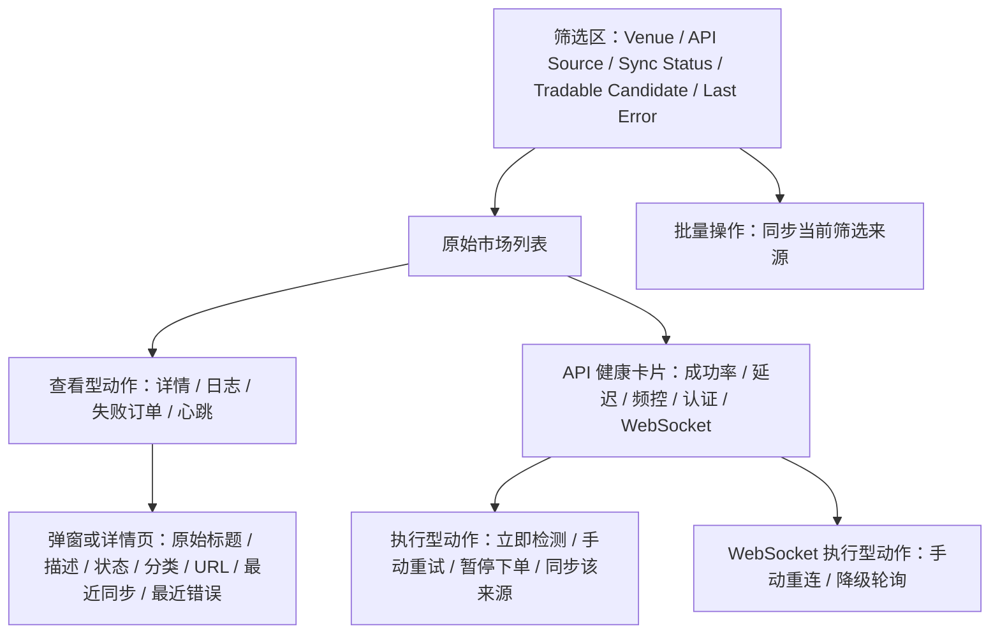

同步操作说明：

- “同步当前筛选来源”：作用对象是当前筛选结果里的所有 `Venue + API Source`，例如 Polymarket Gamma、Predict.fun Markets、Predict.fun Orders、Polymarket CLOB。点击后直接提交批量同步任务并 toast 提示包含的来源数量；该操作只重新拉取原始市场数据，不会下单，不会修改用户订单和持仓。
- “同步该来源”：作用对象是当前列表行对应的单个 `Venue + API Source`，例如只同步 `Predict.fun / Orders`，不影响其他来源。点击后直接提交同步任务并 toast 提示，不需要先进入详情页。
- 同步完成后刷新同步状态、最近错误、是否进入候选池等字段；如失败，需要进入 API 健康详情查看错误码、频控、认证和重试记录。
- 若批量同步需要二次确认或查看范围，弹窗必须展示本次批量包含的全部平台和 API 来源列表，不能只展示某一个默认平台或默认 API。

列表字段：

| 字段 | 说明 |
| --- | --- |
| venue | Polymarket / Predict.fun |
| apiSource | Gamma / Data / CLOB / Markets / Orders / Positions / WebSocket |
| rawTitle | 原始标题 |
| rawStatus | 底层状态 |
| lastSyncAt | 最近同步时间 |
| syncStatus | 成功、失败、延迟、频控 |
| lastError | 最近失败原因 |
| tradableCandidate | 是否进入标准化候选 |

API 健康操作模型：

| 操作 | 适用对象 | 点击后的流程 |
| --- | --- | --- |
| 详情 | 所有平台、所有 API 类型 | 打开详情弹窗或详情页，展示成功率、平均延迟、最近同步时间、最近错误、影响标的数、重试记录和最近日志 |
| 立即检测 / 手动重试 | REST、订单、持仓、市场同步、认证检测 | 直接提交检测或重试任务，并 toast 提示“正在检测/已进入重试队列”；完成后刷新状态、延迟、错误原因和影响范围 |
| 暂停 / 恢复 | 关键交易 API、平台级 API、异常标的 | 当前行已清楚展示影响范围时可在列表直接触发并 toast 反馈；影响范围不清楚、需要填写原因或批量影响较大时进入确认弹窗 |
| 查看日志 | 所有 API 类型 | 打开日志列表，按时间展示请求摘要、错误码、重试次数、调用来源和关联订单/标的 |
| 心跳 | WebSocket 专属 | 打开心跳监控，展示最近心跳、断线次数、重连次数、是否降级轮询 |
| 手动重连 / 降级轮询 | WebSocket 专属 | 直接提交重连或启用轮询任务，并 toast 提示后续会刷新心跳和行情状态 |

不同状态下的建议处理与操作：

| 状态 | 建议处理 | 操作 |
| --- | --- | --- |
| healthy / stable | 健康，定期检测即可 | 详情、立即检测、日志 |
| degraded / rate_limited | 已降级，先确认影响范围 | 详情、手动重试、暂停下单、失败订单 |
| auth_failed | 认证异常，先查看影响并刷新凭证 | 查看影响、刷新凭证、暂停影响范围、查看审计记录 |
| websocket_down / stale | 连接异常，先查看心跳 | 心跳、手动重连、降级轮询、日志 |
| paused | 已暂停，恢复前必须重新检测 | 查看暂停原因、健康检测、恢复、查看审计记录 |

交互规则：

- 列表不再区分“主操作 / 更多操作”，避免运营误以为多个按钮都是同一类动作。
- 列表展示“建议处理”作为运营判断提示，“操作”列承载可点击动作；其中详情、日志、失败订单、心跳为查看型动作，立即检测、手动重试、暂停下单、手动重连、降级轮询为执行型动作。
- 点击查看型动作时，弹窗标题和内容必须与动作一致，例如“详情”“日志”“失败订单”“心跳”不能都展示成同一个泛化详情。
- 点击执行型动作时，不打开详情弹窗，前端立即 toast 反馈，例如“Polymarket Gamma / Data / CLOB 正在检测，完成后会刷新状态和影响范围。”后台仍需记录操作人、操作对象、原因和影响范围。
- 详情弹窗内不展示“待处理”状态标签；用户以查看方式进入详情页时，只展示当前状态、影响范围、记录内容，以及当前状态下可执行的按钮。

后台按钮反馈规范：

| 要素 | 要求 |
| --- | --- |
| 当前操作 | 明确展示操作名称，例如“手动重试同步”“暂停受影响标的下单”“启用降级轮询” |
| 影响范围 | 展示平台、API、标的数、订单数或推荐机会数 |
| 后续流程 | 用步骤说明点击后打开哪个详情区、执行哪些检查、更新哪些状态 |
| 操作结果 | 明确说明是否会改变交易状态、是否影响自动报单/套利提示、是否需要人工二次确认 |
| 审计记录 | 暂停、恢复、轮换认证、导出记录、批量确认、下架推荐等关键动作必须写入审计日志 |

### 9.3 标的过滤规则配置页

目标：配置原平台市场进入本聚合平台的准入规则，决定原始市场是否成为 `TradeableInstrument`，是否进入人工审核，或是否直接过滤。

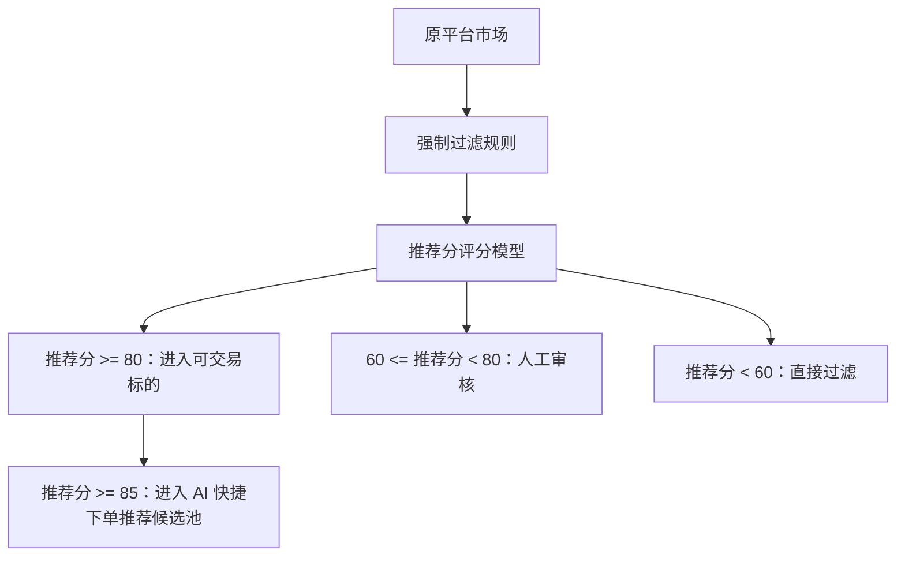

评分模型：

推荐分不是由系统直接给出一个黑盒分数，而是先对每个参数计算 `0-100` 的单项分，再按权重汇总为总推荐分。

推荐分计算公式：

`推荐分 = 流动性分 × 30% + 成交量/热度分 × 20% + 规则清晰度分 × 20% + 到期时间分 × 15% + API 可交易性分 × 15%`

规则要求：

- 每个评分参数都必须支持独立的评分规则配置，不能只配置权重。
- 权重用于决定单项分对总推荐分的影响；单项评分规则用于决定该参数如何得到 `0-100` 分。
- 所有权重合计必须等于 `100%`，否则不允许保存规则。
- 后台权重滑杆必须实时生效，滑动后公式和总权重同步变化。单项权重默认允许 `0-60%`，避免单一参数完全主导准入判断；如后续需要放开，可在配置中调整单项上限。
- 当总权重不等于 `100%` 时，后台必须明确提示当前总权重，并禁用“保存规则”。
- 单项评分规则必须可编辑，包括接口字段来源、评分描述、分段阈值、封顶/降级规则和评分示例。编辑未保存前只影响草稿，不影响线上同步。
- 每个评分项必须有独立“编辑”入口。点击后进入该项评分配置页，运营可以维护参与计算的字段、评分区间、特殊处理和示例。
- 合规/敏感风险不作为推荐分评分项，统一由强制过滤规则和风控审计模块处理，避免同一风险既扣分又过滤造成逻辑重复。
- 强制过滤规则优先级高于推荐分。系统先执行强制过滤规则，再计算推荐分。
- 如果命中“直接过滤”强制规则，即使推荐分很高，也不能进入可交易标的。
- 如果命中“进入人工审核”强制规则，即使推荐分达到自动准入阈值，也必须进入人工审核。

| 参数 | 说明 | 主要字段来源 |
| --- | --- | --- |
| 流动性 | 用盘口深度和价差衡量用户是否能顺畅成交 | `liquidityUsd`、`depthUsdWithin2Pct`、`bestBid`、`bestAsk`、`spreadBps`、`orderbookUpdatedAt` |
| 成交量 / 热度 | 用成交、持仓和原平台热度衡量是否值得展示 | `volume24hUsd`、`tradeCount24h`、`openInterestUsd`、`venueHotRank`、`watchlistCount` |
| 规则清晰度 | 用标准化字段完整度衡量用户能否理解事件如何开奖 | `hasResolutionSource`、`hasResolutionRule`、`hasEndTime`、`hasOutcomeMapping`、`ruleParseStatus`、`descriptionCompleteness` |
| 到期时间 | 用到期时间窗口衡量是否适合一期交易和推荐 | `endTime`、`hoursToClose`、`settlementWindowHours`、`isTradingClosed` |
| API 可交易性 | 用标准化交易能力字段判断是否能真实下单和追踪 | `orderbookStatus`、`quoteAvailable`、`canPlaceOrder`、`canCancelOrder`、`canQueryOrder`、`canQueryPosition`、`authStatus`、`chainSupported`、`collateralSupported` |

单项评分规则：

| 参数 | 默认权重 | 评分区间示例 | 特殊处理 |
| --- | --- | --- | --- |
| 流动性 | 30% | `depthUsdWithin2Pct >= $1M` 且 `spreadBps <= 150` 为 90-100 分；`$300K-$1M` 为 75-89 分；`$100K-$300K` 为 55-74 分；低于 `$100K` 或价差过大为 0-54 分 | `orderbookUpdatedAt` 超过有效期时最高 40 分 |
| 成交量 / 热度 | 20% | `venueHotRank <= 20` 且 `volume24hUsd >= $500K` 为 90-100 分；`volume24hUsd >= $100K` 或 `tradeCount24h >= 100` 为 70-89 分；普通活跃为 45-69 分 | 长期无成交或 open interest 极低不高于 44 分 |
| 规则清晰度 | 20% | 结算来源、规则、到期时间、选项映射全部完整且 `ruleParseStatus=clear` 为 90-100 分；缺少非关键字段为 70-89 分；解析歧义为 40-69 分 | 结算来源缺失、描述无法解析、结果定义冲突可被强制规则拦截 |
| 到期时间 | 15% | `6 小时 <= hoursToClose <= 30 天` 为 90-100 分；`2-6 小时` 为 60-79 分；`30-90 天` 为 55-75 分 | 小于 2 小时、已停止交易或无明确 `endTime` 为 0-50 分 |
| API 可交易性 | 15% | 下单、撤单、Quote、订单查询、持仓查询、认证、链和资产均正常为 95-100 分；非核心查询降级为 70-94 分；Quote 或订单状态不稳定为 40-69 分 | 下单接口不可用、认证失败、链或资产不支持为 0-39 分 |

示例：

- 某 Polymarket BTC 标的：流动性 100、热度 95、规则清晰度 92、到期时间 95、API 可交易性 100，推荐分约为 `96`，自动进入可交易标的，并进入智能推荐候选池。
- 某 Predict.fun CPI 标的：流动性 55、热度 70、规则清晰度 65、到期时间 90、API 可交易性 80，推荐分约为 `69`，进入人工审核。
- 某敏感关键词事件：即使流动性和热度较高，只要标题、描述、标签、分类或结算规则文本命中强制过滤规则，也必须直接过滤或进入人工审核，不按推荐分自动入池。

准入分流规则：

- 推荐分高于自动准入阈值，例如 `>= 80`，自动进入本平台 `可交易标的`。
- 推荐分处于人工审核区间，例如 `60-79`，进入人工审核，由运营决定是否进入 `可交易标的`。
- 推荐分低于过滤阈值，例如 `< 60`，直接过滤，不进入本平台。
- 已进入 `可交易标的` 且推荐分高于智能推荐阈值，例如 `>= 85`，进入 `AI 快捷下单推荐列表` 候选池。

强制过滤规则：

- 强制过滤规则新增时采用“勾选启用条件 + 条件项配置”的表单，不采用单个自由文本框。
- 强制过滤规则必须支持增、删、改、查。列表每条规则提供“查看”“编辑”“删除”；新增和编辑保存后先进入规则草稿，只有点击“保存规则”生成新版本后才对后续同步生效。
- 一次新增可以启用多个条件。多个条件默认按“任一命中即触发”处理；如果后续需要“全部命中才触发”，作为高级组合规则扩展。
- 强制过滤规则一期包含 4 类条件：敏感关键词过滤、分类过滤、到期时间过滤、规则不清晰过滤。
- 不做“地区过滤”配置。原因是底层标的通常没有稳定、结构化的地区字段，无法通过接口参数可靠量化；如果地区名称出现在标题、描述、标签、分类或结算规则文本中，应通过“敏感关键词过滤”处理。
- 敏感关键词过滤：勾选启用后填写关键词，多个关键词用逗号隔开；命中字段包括 `rawTitle`、`normalizedTitle`、`description`、`tags`、`category`、`resolutionRuleText`。
- 分类过滤：勾选启用后填写分类名称，多个分类用逗号隔开。
- 到期时间过滤：勾选启用后可设置“到期早于某个时间点”或“到期晚于某个时间点”，也可以同时设置两端区间。
- 规则不清晰过滤：勾选启用即可，无需额外配置；对应条件为结算来源缺失、结算描述无法解析、结果定义存在明显歧义。
- 流动性不放在强制过滤新增表单中，继续由“流动性单项评分规则”和推荐分阈值处理。
- API 异常不放在强制过滤新增表单中，继续由市场同步、API 认证和风控模块处理。
- 强制规则优先级高于推荐分。命中直接过滤规则时，即使推荐分较高，也不能进入可交易标的。
- 命中强制人工审核规则时，必须进入人工审核，不允许自动准入。

后台展示要求：

- 支持配置评分参数、单项评分规则、权重、自动准入阈值、人工审核区间、过滤阈值和智能推荐阈值。
- 支持配置强制过滤规则，包括敏感关键词、分类、到期时间和规则不清晰。
- 支持规则试算，展示原平台标的、平台、推荐分、准入结果和后续流向。
- 支持标的准入人工审核队列，承接推荐分处于人工审核区间或命中强制人工审核规则的原平台市场。
- 页面需要区分浏览态和编辑态。浏览态展示当前生效规则版本；点击“编辑规则”后才允许修改权重、单项评分规则、阈值和强制过滤规则。
- 单项评分规则以卡片展示摘要，每项必须有“编辑”按钮。编辑页展示字段来源、评分区间配置、特殊处理和评分示例。
- “保存规则”只在编辑态展示。点击保存后生成新的规则版本，变更为浏览态，并写入审计日志。
- 每次保存规则必须记录操作人、规则版本、变更字段、旧值、新值、试算影响范围和生效时间。
- 新增强制过滤规则必须有完整流程：点击“新增规则”后打开表单，填写规则名称、处理动作，勾选敏感关键词过滤、分类过滤、到期时间过滤、规则不清晰过滤中的一个或多个条件；保存后插入规则列表，并提示运营先试算影响范围，再保存规则版本。
- 强制过滤规则保存前应支持试算，展示命中标的数量、示例标的、处理动作和是否影响已入池标的。
- 标的准入人工审核必须展示原始市场 ID、平台、来源、原始标题、推荐分、触发原因、量化字段来源、通过后影响和拒绝后影响。通过后生成 `TradeableInstrument`；拒绝后只保留 `RawVenueMarket` 和审核记录。

### 9.4 可交易标的管理页

目标：管理 `TradeableInstrument`，确保每个前台标的都能准确交易。

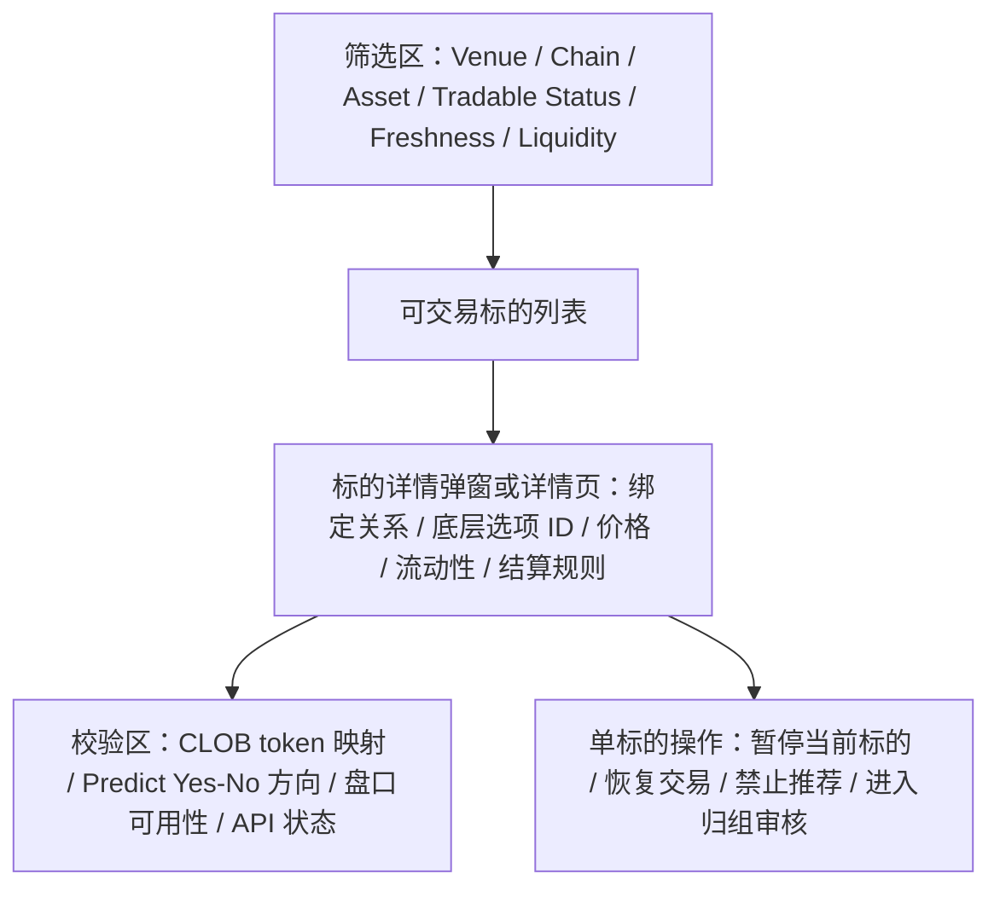

重点补充：

- Polymarket 标的必须校验 CLOB token / outcome 映射。
- Predict.fun 标的必须校验 outcome / side 方向和 No 侧价格转换。
- 可交易状态和是否进入推荐池分开管理。
- “暂停当前标的”只阻止该标的继续提交新订单，不影响同平台其他标的，也不影响已有订单和持仓查询。
- 标的详情中的状态记录需区分系统自动同步、风控规则触发和运营人工操作。

### 9.5 事件归组规则配置页

目标：配置跨平台事件是否归组的评价规则。归组规则采用保守策略：只有极高匹配度才允许归组，不满足阈值则不归组。

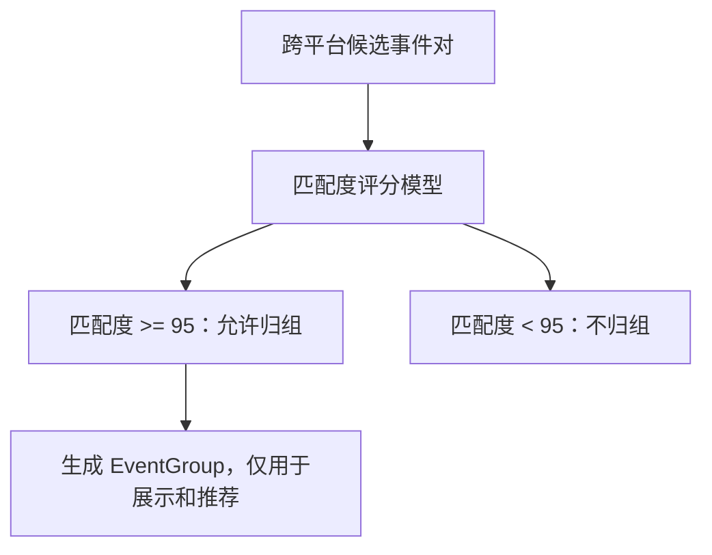

匹配度模型：

匹配度不是黑盒 AI 分数，而是先对每个匹配项计算 `0-100` 的单项分，再按权重汇总为总匹配度。

匹配度计算公式：

`匹配度 = 主题语义相似分 × 25% + 结果定义一致分 × 30% + 结算时间一致分 × 15% + 结算规则一致分 × 25% + 交易参数一致性分 × 5%`

规则要求：

- 每个匹配参数都必须支持独立配置，不能只配置权重。
- 每个匹配参数必须可追溯到标准化接口字段，避免无法解释“为什么归组”。
- 权重合计必须等于 `100%`，否则不允许保存规则。
- 单项权重默认允许 `0-60%`，避免某一项完全主导归组判断。
- 单项匹配规则必须有独立“编辑”入口，支持维护字段来源、匹配逻辑、分值区间、特殊处理和示例。
- Polygon / BNB Chain、USDC / USDT 等平台和资产差异不作为匹配评分项，只作为前台展示、订单详情和风险提示字段。

| 参数 | 说明 | 主要字段来源 |
| --- | --- | --- |
| 主题语义相似 | 用标题、描述、关键词和分类判断是否指向同一事件 | `normalizedTitle`、`rawTitle`、`description`、`category`、`tags`、`semanticEmbeddingScore` |
| 结果定义一致 | 用结果选项和成立条件判断用户买的是不是同一件事 | `outcomeName`、`outcomeSide`、`outcomeDefinition`、`thresholdValue`、`comparisonOperator`、`unit` |
| 结算时间一致 | 用到期时间、结算窗口和时区判断是否同一开奖周期 | `endTime`、`closeTime`、`resolutionTime`、`timezone`、`settlementWindowHours` |
| 结算规则一致 | 用数据源、判定口径和异常处理规则判断是否会按同一标准开奖 | `resolutionSource`、`resolutionRuleText`、`oracleSource`、`dataProvider`、`tieBreakRule`、`ruleParseStatus` |
| 交易参数一致性 | 用价格、交易状态、可交易性辅助判断是否适合放在同主题展示 | `probability`、`bestAsk`、`bestBid`、`tradableStatus`、`marketType`、`collateralToken`、`chainId` |

单项匹配规则：

| 参数 | 默认权重 | 匹配区间示例 | 特殊处理 |
| --- | --- | --- | --- |
| 主题语义相似 | 25% | `semanticEmbeddingScore >= 0.92` 且核心关键词一致为 90-100 分；`0.82-0.92` 为 70-89 分；`0.68-0.82` 为 45-69 分 | 主题范围不同，例如单队冠军 vs 分区冠军，通常不归组 |
| 结果定义一致 | 30% | `outcomeDefinition`、`thresholdValue`、`comparisonOperator`、`unit` 全部一致为 95-100 分；表述不同但条件一致为 80-94 分 | 结果定义冲突时不能归组 |
| 结算时间一致 | 15% | 结束时间差 `<= 5 分钟` 为 95-100 分；`<= 1 小时` 为 75-94 分；`<= 12 小时` 为 40-74 分 | 结束时间差超过 12 小时通常不归组 |
| 结算规则一致 | 25% | 结算来源、数据口径、异常处理全部一致为 95-100 分；来源一致但描述略有差异为 75-94 分 | 判定口径冲突、异常处理不同或规则无法解析时通常不归组 |
| 交易参数一致性 | 5% | 均可交易且概率差 `<= 5%` 为 90-100 分；概率差 `5%-15%` 为 65-89 分 | 交易参数只作辅助，不能单独决定是否同一事件 |

归组分流规则：

- 匹配度高于允许归组阈值，例如 `>= 95`，才允许生成 `EventGroup` 或进入高匹配候选确认。
- 匹配度低于阈值，例如 `< 95`，不归组，也不进入归组审核列表。
- 结果定义、结算时间或结算规则只要无法达到高一致性，就通过匹配度自然降分，不再配置额外的归组拦截规则。

一期边界：

- `EventGroup` 只用于同主题展示、相似推荐、持仓归组展示和套利提示。
- 一期不合并盘口、不合并深度、不合并持仓成本池、不做跨平台拆单。
- 用户下单时仍必须选择具体 `TradeableInstrument`，订单只提交到该标的绑定平台。

后台展示要求：

- 支持配置匹配参数、权重和允许归组阈值。
- 支持配置每个匹配参数的接口字段来源、匹配逻辑、分值区间和示例。
- 归组与过滤不同，归组只接受极高匹配度，不满足则不归组。
- 不在该配置页展示候选事件试算列表，避免运营误以为中低匹配度可以通过人工规则兜底归组。
- 每次规则变更必须记录审计日志，并支持回滚到上一版规则。

### 9.6 EventGroup 归组审核页

目标：审核 AI 归组结果，避免用户把结算规则不同的标的误认为同一事件。

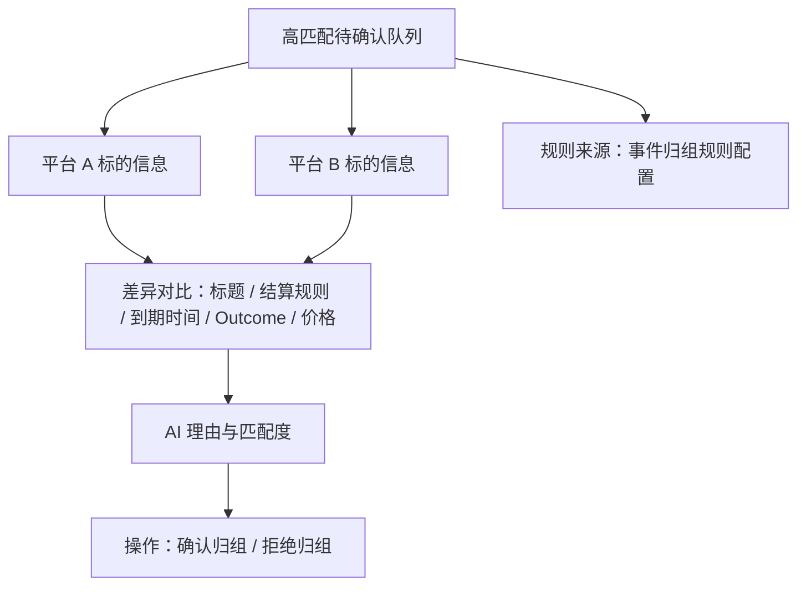

### 9.7 AI 自动报单管理页

目标：管理自动报单候选、文案、排序、上下架和风险暂停。

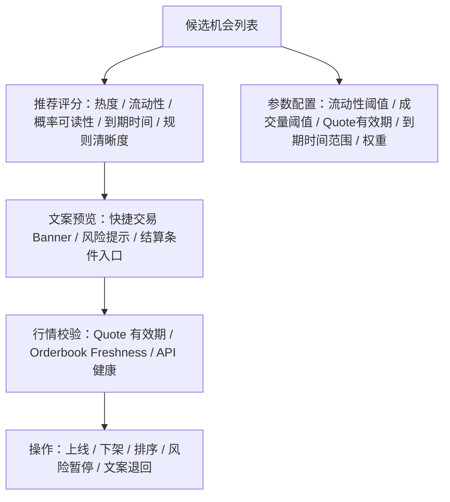

下架原因需要标准化：

- quote_stale
- orderbook_stale
- low_liquidity
- api_error
- auth_error
- near_resolution
- manual_delist
- compliance_block

### 9.8 订单与成交管理页

目标：排查每笔订单从 quote 到签名、提交、成交、撤单的完整链路。

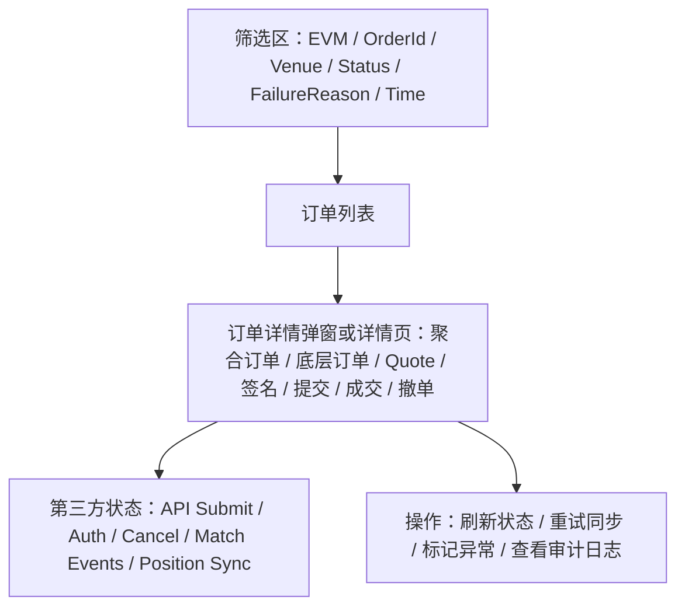

重点补充：

- Polymarket 需要展示 CLOB 提交状态、订单 hash、撤单回执。
- Predict.fun 需要展示 API Key/JWT 认证状态、orderHash、match events 同步状态。
- 失败原因要同时支持用户可读版和研发排查版。

### 9.9 持仓查询页

目标：按 EVM 地址查询两个平台持仓，并支持同主题归组展示。

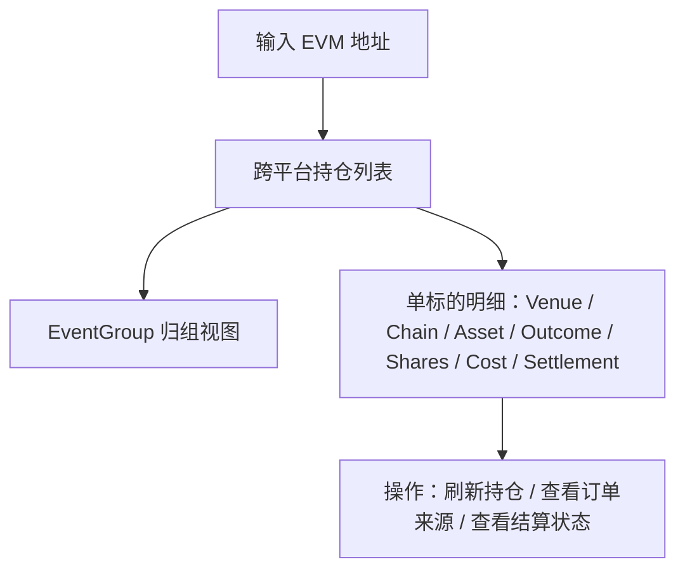

规则：

- 可以按 `EventGroup` 聚合展示主题。
- 每个持仓明细必须显示来源标的。
- 不合并成本池。
- 不生成跨平台净头寸。

### 9.10 API 认证状态监控页

目标：集中监控 Polymarket CLOB 凭证、Predict.fun API Key/JWT 以及相关认证失败。

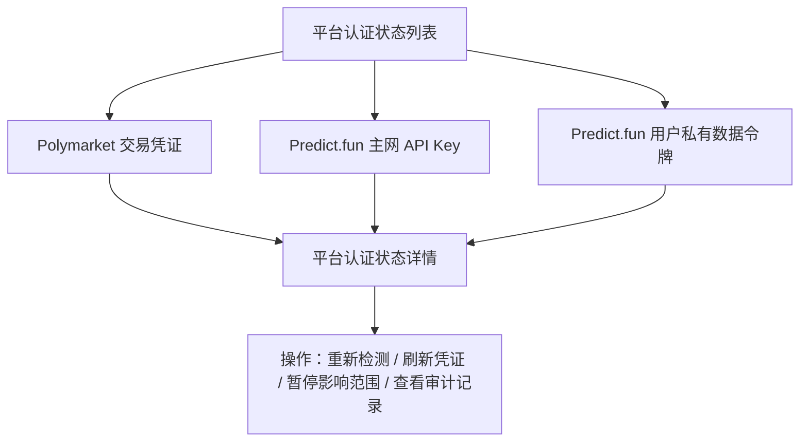

页面规则：

- 列表主按钮统一为“查看”，只负责进入对应认证对象详情，不在列表层直接执行高风险操作。
- 详情页展示认证对象、所属平台、认证类型、用途、当前状态、最近失败、影响范围、有效期、最近检测时间、负责服务。
- 详情页展示影响能力，例如下单、撤单、订单同步、持仓刷新、私有订单流是否正常、降级或阻断。
- 详情页支持重新检测、刷新凭证、暂停影响范围、查看审计记录，并给出明确操作反馈。
- “暂停影响范围”只暂停该认证异常影响到的平台能力或接口能力，不应误伤另一平台，也不应影响已有订单和持仓查询的审计追踪。

### 9.11 风险处理与暂停管理页

目标：以运营可理解的方式查看和处理平台、标的、推荐、地区、行情、交易相关风险，记录每一次拦截、暂停、下架和恢复动作。

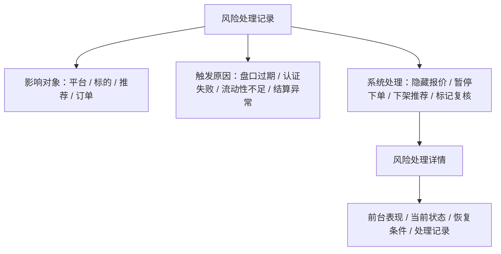

页面规则：

- 列表字段使用通俗名称：记录编号、影响对象、对象类型、触发原因、系统处理、当前状态、时间、操作。
- 列表操作统一为“查看”，进入风险处理详情，不在列表层直接做高风险恢复或暂停操作。
- 详情页必须展示前台会发生什么、当前状态、恢复条件和处理记录。
- 技术规则名可以作为内部字段保留，但不作为运营主文案展示。
- 所有自动拦截、人工暂停、恢复、下架推荐、重新上线动作都必须进入处理记录和审计日志。

### 9.12 审计日志页

目标：完整记录用户交易、后台操作、系统自动下架和风控命中。

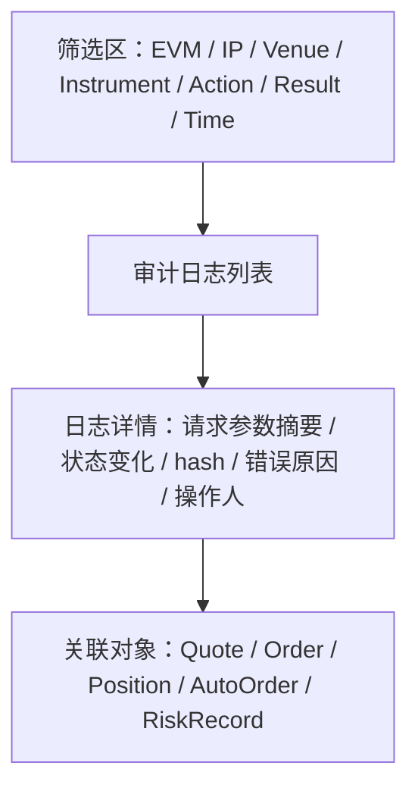

### 9.13 WebSocket / 行情 stale 监控页

目标：监控行情实时性，保障 quote、自动报单和套利提示不使用过期价格。

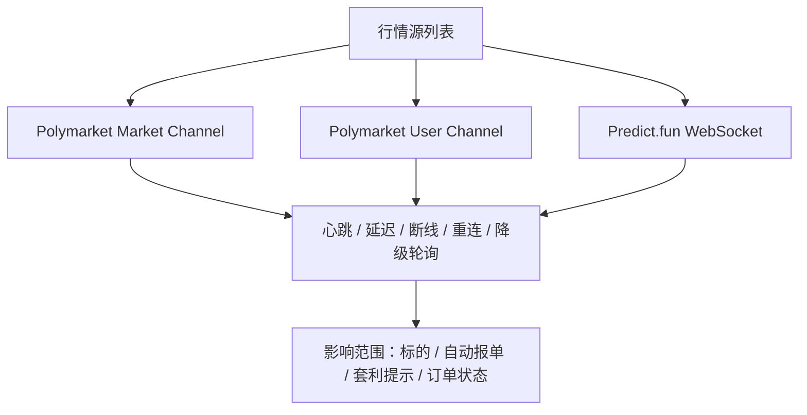

### 9.14 结算追踪与通知页

目标：支撑 PM A 的持仓结算追踪和推送通知。

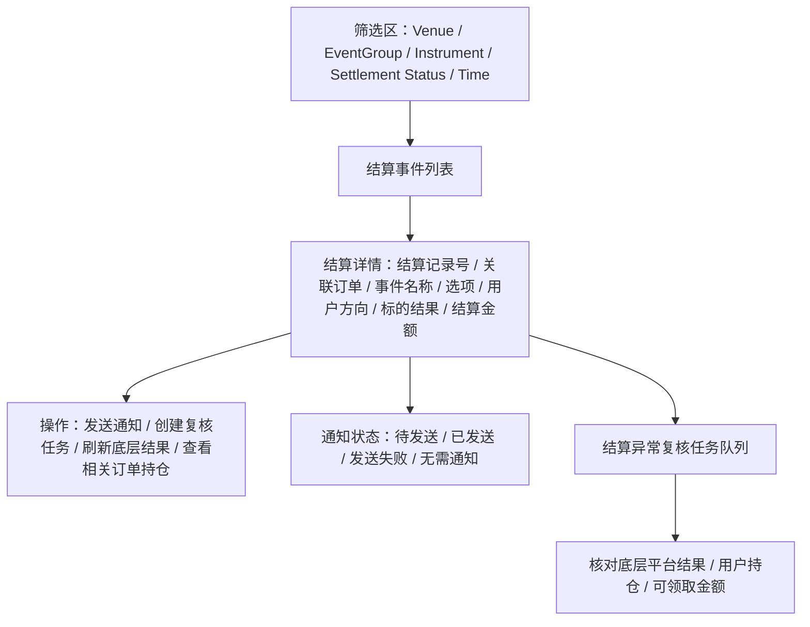

重点补充：

- 可查看事件结算状态和用户持仓结算状态。
- 可定位结算异常影响的标的、订单和持仓。
- 结算列表中的通知状态只展示通知本身状态，例如待发送、已发送、不发送、发送失败；“已暂停标的”属于异常处理动作，应在结算详情或风控记录中展示。
- 结算异常必须形成闭环：点击“创建复核任务”后，应在“结算异常复核任务”队列中生成任务，展示任务编号、关联结算记录、关联订单、平台、任务状态、下一步和处理人。
- 异常结算详情的主操作必须根据任务状态变化：未创建复核任务时展示“创建复核任务”；已有关联复核任务时展示“查看复核任务”。从复核任务队列点击“查看结算”进入同一个结算详情时，不应再次展示“创建复核任务”。
- “底层平台结果”指 Polymarket / Predict.fun 对该事件给出的最终开奖、用户持仓结算状态、可领取金额或失败原因。后台需要提供刷新底层结果、确认结果、继续等待三个动作。
- 只有底层平台结果、用户持仓和可领取金额都确认后，才能生成结算金额、恢复通知或关闭异常；否则通知状态应保持“不发送”。
- 可输出 PM A 需要的通知触发信号。

### 9.15 数据报表与护栏指标页

目标：支撑 PM A 的业务指标、埋点报表和系统护栏。

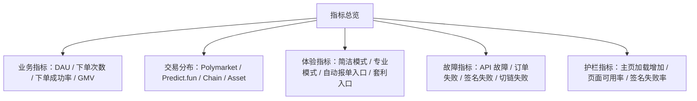

重点补充：

- API 故障频次与时长必须可按平台和 API 类型拆分。
- 订单失败率必须可按失败原因拆分。
- GemW 主页加载增加超过 200ms、聚合器可用率低于 99%、签名失败率高于 1% 时应触发告警。

## 10. 里程碑

### M1：API 适配与标的底座

PM B 交付：

- Polymarket Gamma / Data / CLOB 用途拆分。
- Predict.fun Categories / Markets / Search 接入。
- `RawVenueMarket` 和 `TradeableInstrument`。
- 原始市场同步后台。
- 标的过滤规则后台。
- 可交易标的后台。
- 事件归组规则后台。

联合验收：

- PM A 能展示两个平台精选标的。
- 后台能看同步状态、失败原因、标的过滤规则、推荐分和可交易判断。
- 后台能配置事件归组匹配度规则，并区分高匹配待确认和不归组；低于阈值或关键参数冲突的候选不进入人工审核列表。

### M2：行情、钱包与单平台 quote

PM B 交付：

- CLOB / Predict orderbook 接入。
- WebSocket 监控和降级轮询。
- 钱包、切链、余额、授权、认证状态。
- Quote 状态机。

联合验收：

- PM A 快捷面板能展示有效 quote 和阻断状态。
- quote 过期、行情 stale、授权不足时不能提交。

### M3：Taker 闭环

PM B 交付：

- Polymarket CLOB Taker。
- Predict.fun Market order。
- 订单提交、状态同步、失败原因、审计。

联合验收：

- 用户可完成小额测试或白名单真实交易。
- 每笔订单只映射一个 venue order。

### M4：Maker 与撤单

PM B 交付：

- Polymarket CLOB Limit order。
- Predict.fun Limit order。
- 当前委托、部分成交、撤单、撤单失败处理。

联合验收：

- PM A 专业面板可挂单、看委托、撤单。
- Maker 不跨平台复制，不自动切换平台。

### M5：自动报单、风控与后台完善

PM B 交付：

- 自动报单后台。
- 套利空间提示计算和失效规则。
- 结算追踪和通知触发信号。
- 数据报表和护栏指标后台。
- 风控规则和暂停管理。
- 平台健康监控。
- 审计日志。

联合验收：

- 自动报单能上线、下架、风险暂停。
- API 异常、行情 stale、低流动性时自动下架。
- PM A 能展示“可套利”提示，且提示失效时自动隐藏。
- PM A 能展示持仓结算状态并接收结算通知触发信号。
- DAU、下单成功率、GMV、平台分布、模式分布、API 故障和订单失败率可在后台查看。

## 11. 验收标准

### 11.1 API 能力映射验收

- Polymarket Gamma / Data / CLOB 的用途在 PRD 中被正确拆开。
- Predict.fun Markets / Orders / Positions / Authorization / WebSocket 的能力被映射到产品模块。
- 文档没有把第三方 API 写成字段字典，而是落到产品页面、状态、流程、风控和验收。

### 11.2 前后台对齐验收

- PM A 的快捷面板能获得 quote、收益测算、最大亏损、切链/授权/签名状态。
- PM A 的专业面板能获得盘口、成交历史、Limit/Market、当前委托和撤单状态。
- PM A 的订单页和持仓页能获得统一状态、失败原因和底层追溯字段。
- 自动报单 Banner 的展示、隐藏、下架原因与后台状态一致。
- 最优赔率高亮、到手收益、平台/标的 tab 预选可以由 PM B 的 quote 和标准化标的数据支撑。
- 结算追踪、推送通知、埋点报表和护栏指标可以由 PM B 数据服务支撑。

### 11.3 交易执行验收

- 点击 Polymarket 标的只走 Polymarket / Polygon / USDC / CLOB。
- 点击 Predict.fun 标的只走 Predict.fun / BNB Chain / USDT。
- Maker、Taker、撤单都只作用于当前 `TradeableInstrument`。
- 每笔聚合订单只映射一个底层 venue order。
- quote 过期、行情过期（stale）、余额不足、授权不足、认证失败、切链失败时不提交真实订单。

### 11.4 后台验收

- 后台能查看原始市场、标的过滤规则、可交易标的、事件归组规则、归组审核、智能推荐、订单管理、持仓结算、风控审计、API 认证和数据报表。
- 标的过滤规则能配置单项评分规则、评分权重、强制过滤规则、自动准入阈值、人工审核区间、过滤阈值和智能推荐阈值。
- 事件归组规则能配置匹配度权重、单项匹配规则和允许归组阈值；低于阈值的候选事件不归组。
- CLOB / Predict 订单提交失败、撤单失败、认证失败、频控命中都有后台可查原因。
- WebSocket 断连、心跳失败、行情过期（stale）能展示影响范围。
- 风控命中、人工暂停、自动下架都有审计日志。
- 后台能查看结算异常、通知状态、业务报表和系统护栏指标。

## 12. 已确认决策与待确认问题

### 12.1 已确认决策

- 钱包支持：一期支持所有可注入连接、可完成 EVM 签名的钱包，包括 GemW 内置钱包、注入式钱包和 WalletConnect 类钱包；用户私钥只在钱包侧保存和签名，GemW 服务器不接触私钥。
- 归组和合并展示参数：做成后台可配置，由运营按关键字段勾选一致性要求，并配置匹配度权重和允许归组阈值；低于阈值或关键参数冲突的市场不进入归组确认列表。
- 自动报单参数：最低流动性、最低成交量、quote 有效期、到期时间范围、推荐分权重、上下架阈值均做成后台可配置。
- 地区限制、服务条款、风险披露：由公司法务和运营共同拟定并确认。
- 套利空间提示：优先级为 P0；PM B 提供计算、有效期和失效规则，PM A 负责前台展示和风险文案。

### 12.2 待确认问题

- Polymarket CLOB 交易凭证、funder address、签名类型是否已完成研发验证。
- Predict.fun Mainnet API Key 是否已申请，测试网是否满足完整交易闭环验证。
- 一期主网交易是否先做白名单灰度。
- 法务和运营确认后的地区限制名单、服务条款、风险披露文案版本号和上线时间。
