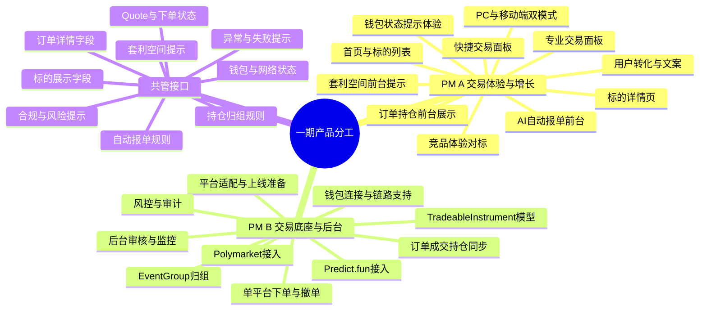

# 一期产品经理分工方案

版本：v1.4

更新时间：2026-06-04

## 1. 一期产品分工原则

一期产品不是简单的页面项目，也不是单纯的后台系统项目，而是一个带真实交易、钱包签名、底层平台订单、风控审计和运营推荐的预测市场聚合交易产品。

因此，两位产品经理不建议按“前台 / 后台”简单切分，也不建议按“Polymarket / Predict.fun”两个平台切分。更合理的方式是：

> 端到端模块责任 + 关键接口共管。

推荐分工：

- PM A：交易体验与增长转化负责人。
- PM B：交易基础设施、后台运营与风控负责人。

分工目标：

- 每个一期 P0 模块都有唯一主负责人。
- 每个跨模块接口都有 PM A / PM B 共管边界。
- 用户前台体验、交易执行、后台运营、风控审计、平台数据接入、钱包与链路支持、AI 智能化能力、合规地域限制、测试验收与上线准备全部覆盖。
- 后续可以直接基于该分工继续拆 PRD、原型、接口需求和里程碑计划。

## 2. 组织角色与责任边界

### 2.1 PM A：交易体验与增长转化负责人

定位：

- 负责用户看得见、点得到、能理解、能完成交易的完整体验。
- 核心目标是让小白用户愿意下单，让专业用户能高效交易，并在体验、智能化和转化效率上形成相对 agg.market 的差异。

主责范围：

- 首页 / 标的列表。
- 标的详情页。
- 快捷交易面板。
- 专业交易面板。
- AI 自动报单前台入口。
- 套利空间提示的前台展示。
- 订单 / 持仓前台展示。
- 钱包连接、切链、授权、签名的用户提示体验。
- PC 与移动端双模式体验。
- 用户转化路径、提示文案和埋点漏斗。
- 竞品体验对标与用户侧创新方案。

不主责但必须参与评审：

- quote 生成规则。
- 钱包切链和授权状态。
- 订单状态机。
- 后台推荐规则。
- 风控拦截规则。
- 地区限制、风险披露、服务条款等用户可见合规提示。

### 2.2 PM B：交易基础设施、后台运营与风控负责人

定位：

- 负责标的、钱包、订单、持仓、后台、风控等交易底座。
- 核心目标是保证每一笔交易可执行、可追踪、可风控、可运营，并确保底层平台接入、钱包链路和数据服务能支撑前台体验。

主责范围：

- Polymarket 数据接入。
- Predict.fun 数据接入。
- `TradeableInstrument` 标准化标的。
- `EventGroup` 事件主题归组。
- 钱包连接、自动切链、余额、授权、签名状态和链上资产支持。
- 单平台 Taker、Maker、撤单交易执行。
- 订单、成交、持仓同步。
- 后台归组审核、自动报单管理、监控告警。
- 风控、审计和异常处理。
- API Key、第三方 API 频控、熔断、测试环境和上线准备。
- 数据对象、状态机、验收用例和技术接口需求。

不主责但必须参与评审：

- 标的卡片字段。
- 下单前台流程。
- 订单失败提示。
- 自动报单前台文案。
- 持仓和订单的用户可读展示。
- 快捷交易、套利提示、钱包异常等前台关键转化路径。

## 3. PM A：交易体验与增长转化

### 3.1 负责模块

#### 首页 / 标的列表

负责内容：

- 精选标的、热门标的、分类、搜索、排序。
- 同主题标的归组展示。
- 完全相同投资参数的同主题事件合并展示方案。
- 标的卡片里的价格、概率、流动性、到期时间、状态展示。
- AI 自动报单 banner 入口。
- 套利空间提示入口。
- 不可交易标的的按钮状态和提示。

交付物：

- 首页 / 列表页 PRD。
- 标的卡片字段说明。
- 同主题归组与合并展示规则的前台说明。
- 列表页空状态、加载状态、异常状态说明。

#### 标的详情页

负责内容：

- 标题、描述、结算规则、价格 / 概率、流动性、成交量、价格走势。
- 快捷交易面板和专业交易面板切换。
- 同主题其他平台标的展示。
- 完全相同投资参数时的平台 / 标的切换控件。
- 套利空间提示的展示位置和风险说明。
- 底层平台信息弱展示或折叠展示。

交付物：

- 标的详情页 PRD。
- 快捷 / 专业模式切换说明。
- 合并主题详情页交互说明。
- 套利空间提示前台交互说明。

#### 快捷交易面板

负责内容：

- 买 Yes / 买 No。
- 投入金额。
- 当前价格 / 概率。
- 预计获得份额。
- 若结果成立可获得金额。
- 最大亏损。
- 到期时间。
- 结算条件入口。
- 钱包连接、切链、授权、签名状态的前台提示。
- 确认按钮状态。

设计原则：

- 默认面向小白用户。
- 不展示盘口深度、复杂平台信息和复杂套利组合。
- 重点让用户快速理解“投入多少、买什么结果、最多亏多少、成功后得到多少”。

交付物：

- 快捷交易面板 PRD。
- 快捷下单交互稿说明。
- 快捷下单文案规范。
- 下单失败、quote 过期、余额不足、授权不足、切链失败提示文案。

#### 专业交易面板

负责内容：

- Market / Limit。
- 买入 / 卖出。
- outcome。
- 价格。
- 数量。
- 金额。
- 最大滑点。
- 订单有效期。
- 当前标的盘口。
- 成交历史。
- 当前委托。
- 撤单入口。

设计原则：

- 面向熟练用户和专业交易用户。
- 可以展示底层平台、链、资产、盘口、订单 hash 等信息。
- 仍然遵守一期单标的单平台交易模型，不做跨平台盘口合并。

交付物：

- 专业交易面板 PRD。
- Maker 挂单和撤单前台交互说明。
- 盘口、成交历史、当前委托展示说明。

#### AI 自动报单前台

负责内容：

- 首页 banner。
- 推荐卡片。
- 弹窗或快捷下单窗口。
- 自动报单文案。
- 推荐理由的用户可读表达。
- 快捷下单转化路径。

文案方向：

- 示例：“0.88 USDC 买入，若结果成立可变成 1 USDC”。
- 必须同时展示概率、到期时间、最大亏损、结算条件入口。
- 不承诺收益，不使用“稳赚”“无风险”等表述。

交付物：

- 自动报单前台 PRD。
- 推荐卡片和 banner 文案规范。
- 推荐入口到快捷下单的转化漏斗。

#### 智能化与竞品体验对标

负责内容：

- 对标 agg.market 的市场聚合、价格比较、交易组件和简单交易体验。
- 输出我们一期在用户侧的差异化体验：快捷下单、AI 自动报单、套利空间提示、同主题标的切换、中文/亚洲用户友好表达。
- 将 Polymarket 和 Predict.fun 的复杂交易概念翻译成用户能理解的表达，例如概率、最大亏损、到期时间、结算条件、失败原因。
- 定义自动报单的用户触达位置，包括首页 banner、标的卡片、详情页窗口和快捷交易入口。
- 定义套利空间提示的用户理解边界：只提示机会，不承诺无风险，不自动组合下单。

交付物：

- 竞品体验对标清单。
- 一期智能化体验 PRD。
- 自动报单与套利提示的前台样式、文案和转化路径。
- 小白用户关键解释文案库。

#### 订单 / 持仓前台展示

负责内容：

- 当前委托、历史订单、成交记录、失败订单。
- 持仓列表、持仓详情、同主题归组。
- 用户可理解的订单状态和失败原因。
- 底层平台弱展示，但订单详情可追溯。

交付物：

- 订单页和持仓页前台 PRD。
- 用户可读状态文案。
- 订单和持仓列表字段说明。

#### PC 与移动端双模式

负责内容：

- PC 和移动端都必须支持快捷版与专业版。
- 新用户、移动端、AI 自动报单入口默认进入快捷版。
- 熟练用户、PC 端、盘口入口可以默认进入专业版。
- 用户选择过的模式需要记忆。
- 切换模式时保留方向、金额、价格等核心字段。

交付物：

- PC / 移动端双模式体验说明。
- 模式记忆规则。
- 模式切换字段保留规则。

### 3.2 PM A 核心验收标准

- 小白用户可以在快捷模式完成一次买入。
- 专业用户可以在专业模式挂限价单并撤单。
- 用户不需要理解平台差异，也能知道自己买了什么、最多亏多少、成功后得到多少。
- 前台弱化平台品牌，但订单详情可以追溯底层平台。
- AI 自动报单入口能把用户顺畅带到快捷下单。
- 移动端和 PC 端都能在快捷版与专业版之间切换。

## 4. PM B：交易基础设施、后台运营与风控

### 4.1 负责模块

#### 市场与标的数据接入

负责内容：

- 同步 Polymarket 事件、市场、outcome、价格、流动性、成交量、结束时间、状态、结算规则链接。
- 同步 Predict.fun 市场、outcome、价格、流动性、成交量、结束时间、状态、结算信息。
- 建立原始平台市场表，保留 venue、venueMarketId、原始标题、原始描述、原始状态、原始链接。
- 处理第三方 API 异常、频控、超时、熔断和重试。

交付物：

- 市场数据接入 PRD。
- 第三方 API 字段映射说明。
- 数据同步异常处理说明。
- 后台原始市场列表需求。

#### 标准化标的：TradeableInstrument

负责内容：

- 将底层平台市场标准化为 `TradeableInstrument`。
- 每个 `TradeableInstrument` 必须绑定唯一 venue、chainId、collateralToken、venueMarketId、outcomeId 和订单接口。
- 保证前台每个可交易标的都能追溯到唯一底层平台市场。

交付物：

- 标准化标的数据对象说明。
- 标的状态机。
- 可交易 / 不可交易判断规则。

#### 事件主题归组：EventGroup

负责内容：

- 使用 AI / 文本相似度将相似主题归入 `EventGroup`。
- `EventGroup` 只用于展示、搜索、相似推荐和持仓归组，不代表盘口合并。
- 低置信度、规则差异明显或结算边界不一致的归组进入人工审核。
- 支持完全相同投资参数标的的合并展示基础数据。

交付物：

- EventGroup 数据对象说明。
- 归组状态机。
- 归组审核后台 PRD。
- AI 归组理由和置信度字段说明。

#### 钱包与网络

负责内容：

- 支持 WalletConnect 类 EVM 钱包连接。
- EVM 地址作为用户唯一 ID。
- Polymarket 标的下单前自动切 Polygon。
- Predict.fun 标的下单前自动切 BSC / BNB Chain。
- 检查当前链、余额、授权、签名状态。
- 处理切链失败、未添加链、用户拒绝签名、资产不足、授权不足。

交付物：

- 钱包连接和网络切换 PRD。
- 授权、余额、签名状态说明。
- 钱包异常处理清单。

#### 平台适配与上线准备

负责内容：

- 明确 Polymarket Gamma / Data / CLOB API 的产品使用范围：市场发现、盘口价格、下单、撤单、订单和持仓查询。
- 明确 Predict.fun REST API / WebSocket / SDK 的产品使用范围：市场、订单簿、订单、撤单、账户、持仓和实时行情。
- 跟进 Polymarket 交易签名类型、funder address、L2 API 凭证、Polygon 资产要求和 API 频控。
- 跟进 Predict.fun API Key、BNB Chain 主网/测试网、USDT 授权、Smart Wallet / EOA 差异和 Beta 接口变更风险。
- 明确一期不接入 agg.market 的 managed balance、omni-chain funding、跨场所路由和拆单能力，只将其作为竞品体验和二期能力参考。
- 输出测试环境、白名单灰度、API Key、签名凭证、监控指标和异常回滚要求。

交付物：

- Polymarket 接入需求说明。
- Predict.fun 接入需求说明。
- 第三方接口和凭证准备清单。
- 主网 / 测试网验收清单。
- API 频控、熔断和降级说明。

#### 单平台交易执行

负责内容：

- Taker 下单。
- Maker 挂单。
- 撤单。
- 每笔聚合订单只映射一个 venue order。
- 不跨平台复制 Maker 订单，不拆单，不自动选择其他平台。

交付物：

- 单平台交易执行 PRD。
- Taker / Maker / 撤单流程说明。
- Quote 状态机。
- SingleVenueOrder 状态机。
- 失败原因映射表。

#### 订单、成交、持仓同步

负责内容：

- 按 EVM 地址查询订单、成交、持仓。
- 聚合订单号与底层平台订单 ID 映射。
- 底层平台订单 hash、txHash、signatureHash 记录。
- 持仓按同主题归组展示，但不合并为同一成本池。
- 保留 venue、chainId、collateralToken、venueMarketId、outcomeId。

交付物：

- 订单 / 成交 / 持仓同步 PRD。
- 订单详情字段说明。
- 持仓详情字段说明。
- 审计日志字段说明。

#### 后台系统

负责内容：

- 归组审核后台。
- 自动报单管理后台。
- 平台 API 监控后台。
- 标的暂停、推荐下架、风险暂停。
- 推荐理由、文案、状态和下架原因管理。

交付物：

- 后台系统 PRD。
- 运营角色权限说明。
- 后台审核流程说明。
- 平台健康监控字段说明。

#### 风控与审计

负责内容：

- 地区限制。
- quote stale。
- 流动性不足。
- API 异常。
- 钱包切链失败。
- 签名失败。
- 授权不足。
- 余额不足。
- 推荐标的自动下架。
- 所有下单、撤单、失败行为记录审计日志。

交付物：

- 风控规则 PRD。
- 异常处理清单。
- 风控拦截优先级。
- 审计日志字段说明。

### 4.2 PM B 核心验收标准

- 每个标的都能追溯到唯一底层平台。
- 点击哪个标的，就只调用该标的绑定平台。
- Polymarket 自动走 Polygon，Predict.fun 自动走 BSC。
- Maker 不跨平台复制，不拆单，不自动选平台。
- 后台能审核归组、管理推荐、暂停异常标的。
- 风控命中时不会提交真实订单。
- 每笔订单、撤单、失败都有可审计记录。

## 5. 共管接口与协作机制

以下模块必须由 PM A 和 PM B 共同评审，避免体验和交易底座脱节。

### 5.1 标的卡片字段

PM A 负责：

- 用户可读展示。
- 字段优先级。
- 卡片布局。
- 异常状态和按钮状态。

PM B 负责：

- 字段来源。
- 刷新频率。
- 缓存和过期策略。
- 可交易状态判断。

共同确认：

- 标题。
- 价格 / 概率。
- 流动性。
- 到期时间。
- 结算规则入口。
- 链 / 资产弱提示。
- 套利空间提示。

### 5.2 自动报单

PM A 负责：

- 前台样式。
- 推荐文案。
- 转化路径。
- banner、弹窗、推荐卡片。

PM B 负责：

- 推荐规则。
- 推荐分。
- 上下架条件。
- 风控拦截。
- 后台审核。

共同确认：

- 推荐阈值。
- 文案审核规则。
- 下架原因。
- 用户看到的风险提示。

### 5.3 下单流程

PM A 负责：

- 交互路径。
- 确认页信息。
- 按钮状态。
- 失败提示。

PM B 负责：

- quote。
- 授权。
- 签名。
- 提交。
- 状态同步。
- 风控拦截。

共同确认：

- 下单前必须展示的信息。
- quote 过期后的交互。
- 钱包异常后的阻断方式。
- 成功、失败、处理中状态。

### 5.4 订单与持仓

PM A 负责：

- 用户理解成本、收益、状态。
- 列表和详情页字段展示。
- 失败原因的用户可读表达。

PM B 负责：

- 底层平台信息。
- 状态映射。
- hash、订单 ID、审计追踪。
- 持仓归组但不合并成本池。

共同确认：

- 订单详情字段。
- 持仓详情字段。
- 底层平台信息展示层级。
- 同主题归组规则。

### 5.5 套利空间提示

PM A 负责：

- 展示位置。
- 提示文案。
- 风险说明。

PM B 负责：

- 计算条件。
- 有效时间。
- 失效条件。
- 下架规则。

共同确认：

- 一期只做信息提示。
- 不自动组合下单。
- 不做拆单。
- 不承诺无风险收益。

## 6. 里程碑分工

### M1：数据和标的底座

PM A：

- 标的列表展示需求。
- 标的卡片字段。
- 同主题归组展示方式。

PM B：

- 数据接入。
- 标的标准化。
- 归组审核后台。

联合验收：

- 前台能展示两个平台的精选标的。
- 后台能看到原始市场和标准化标的。
- 同主题可归组但不合并盘口。

### M2：钱包和单平台交易底座

PM A：

- 连接钱包体验。
- 切链提示。
- 授权提示。
- 失败提示。

PM B：

- 钱包状态。
- 链切换。
- 授权检查。
- 单平台 quote。

联合验收：

- 用户连接钱包后识别 EVM 地址。
- Polymarket 标的触发 Polygon 切链。
- Predict.fun 标的触发 BSC 切链。
- 切链失败、余额不足、授权不足时阻止下单。

### M3：快捷交易闭环

PM A：

- 快捷交易面板。
- 自动报单入口。
- 下单确认体验。

PM B：

- Taker 提交。
- 订单状态。
- quote 过期。
- 风控拦截。

联合验收：

- 用户可以通过快捷面板完成一次小额真实或测试交易。
- 用户能理解最大亏损和成功后收益。
- 失败原因明确。

### M4：专业交易与 Maker

PM A：

- 专业交易面板。
- 盘口展示。
- 当前委托展示。
- 撤单交互。

PM B：

- Limit order。
- 撤单接口。
- 订单状态同步。

联合验收：

- 用户可以在当前标的挂单、查看状态、撤单。
- 每笔订单只映射一个底层平台订单。

### M5：自动报单与后台风控

PM A：

- 推荐 banner。
- 文案规范。
- 转化漏斗。

PM B：

- 推荐规则。
- 后台审核。
- 自动下架。
- 监控告警。

联合验收：

- 自动报单能生成快捷购买入口。
- 异常标的自动下架。
- 后台可查看推荐理由、文案、状态和下架原因。

## 7. 脑图

## 8. 验收标准

分工方案验收：

- 每个一期 P0 模块都有唯一主负责人。
- 每个跨模块接口都有 PM A / PM B 的共管边界。
- 没有模块同时被两人主责，也没有模块无人负责。
- 用户体验、交易执行、后台运营、风控审计、平台数据接入、钱包链路支持、AI 智能化、合规地域限制、测试验收和上线准备都被覆盖。
- 后续可以直接基于该分工继续拆 PRD、原型、接口需求和里程碑计划。

PM A 交付验收：

- 前台页面 PRD 完整。
- 快捷交易和专业交易交互完整。
- 自动报单前台路径清晰。
- 套利空间提示有清晰入口、文案和风险边界。
- 订单、持仓、失败提示文案可被用户理解。
- 钱包连接、切链、授权、签名等状态提示能被用户理解。
- PC 和移动端都有快捷版和专业版。
- 竞品体验对标清单能说明我们相对 agg.market 的一期差异化重点。

PM B 交付验收：

- 标的、订单、持仓、钱包、风控、自动报单、审计对象定义清晰。
- 每个标的绑定唯一底层平台。
- 下单、挂单、撤单都只走当前标的绑定平台。
- Polymarket / Polygon / USDC 与 Predict.fun / BSC / USDT 的链路、资产、授权、签名、API 凭证和异常处理明确。
- 第三方 API 频控、熔断、测试环境、白名单灰度和上线检查清单明确。
- 后台可以审核、推荐、下架、监控。
- 风控命中不会提交真实订单。

共管验收：

- 标的卡片字段来源和展示一致。
- 下单流程的前台状态和底层状态一致。
- 自动报单前台入口和后台规则一致。
- 订单 / 持仓展示和底层平台数据一致。
- 套利空间提示不被误解为自动套利或无风险收益。
- 钱包异常、地区限制、服务条款、风险披露等用户提示与后台拦截规则一致。

