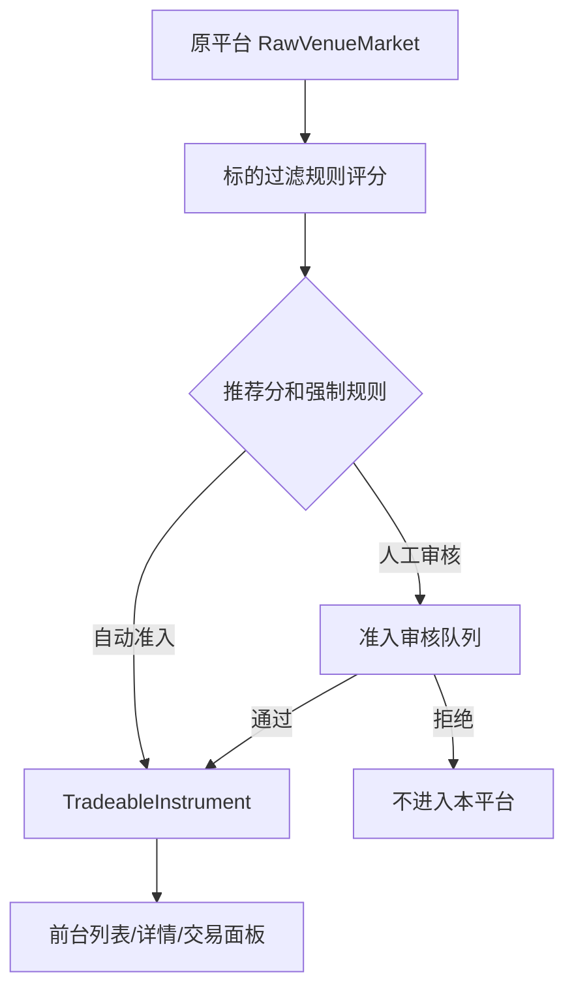
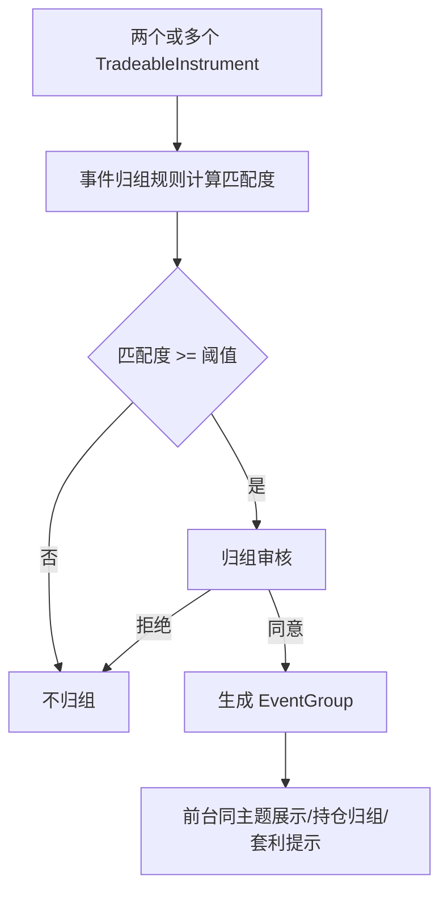
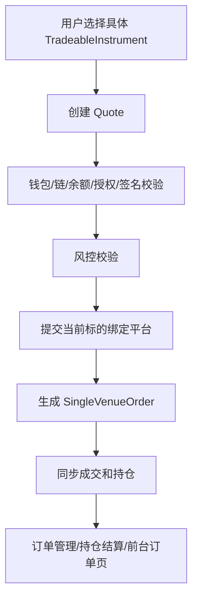
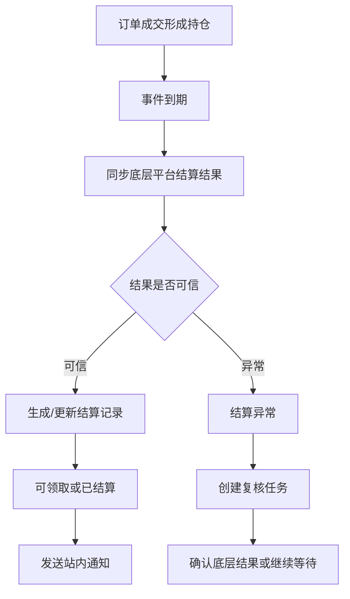

# 管理后台 PRD

版本：v1.1

更新时间：2026-06-12

适用范围：预测市场聚合器一期 PM B 管理后台、后台服务、接口联调、测试用例编写、运营使用培训。

关联文档：

- `PM B一期PRD.md`
- `接口文档.md`
- 当前管理后台前端原型：`src/App.tsx`

## 版本更新记录

| 版本 | 更新时间 | 更新内容 |
| --- | --- | --- |
| v1.1 | 2026-06-12 | 补充文档版本管理规范，新增版本更新记录表；后续修改管理后台模块、字段、流程、规则公式或测试要求时需同步更新版本号、更新时间和变更说明。 |
| v1.0 | 2026-06-12 | 输出管理后台专项 PRD，覆盖各模块功能、字段接口、交互流程、后端逻辑、规则公式和测试关注点。 |

## 1. 文档定位

本文是一期 PM B 管理后台的专项 PRD，目标是把管理后台的页面、字段、按钮、接口、规则公式、后端逻辑和测试关注点全部串成闭环。

本文不替代 `PM B一期PRD.md`。`PM B一期PRD.md` 定义一期产品边界和交易底座；本文定义管理后台如何落地这些能力，以及前端、后端、测试和运营如何对同一字段、同一操作形成一致理解。

本文需要同时满足三类读者：

- 前端 / 后端开发：明确每个模块需要开发什么、字段来自哪个接口、按钮触发哪个后端动作、哪些状态会影响前台用户端。
- 后台运营：明确每个页面用于处理什么业务、什么情况下点击什么按钮、操作后会产生什么影响。
- 测试人员：明确页面字段、状态、按钮、规则公式、异常流和审计日志如何编写测试用例。

## 2. 一期后台设计原则

### 2.1 一期产品边界

- 只做标的聚合，不合并盘口深度。
- 每个可交易标的只绑定一个底层平台、一个链、一个结算资产、一个底层市场和一个底层选项。
- 用户点击哪个标的，就只向该标的绑定的平台下单。
- Maker 挂单、Taker 吃单和撤单都只发生在当前标的绑定平台。
- 不做跨平台拆单。
- 不做智能路由。
- 不做托管账户。
- 不做跨链资金调度。
- EventGroup 只用于同主题展示、持仓归组、智能推荐和套利提示，不作为交易对象。

### 2.2 管理后台交互原则

后台按钮分为两类：

| 类型 | 示例 | 用户预期 | 后端行为 |
| --- | --- | --- | --- |
| 查看型按钮 | 查看、详情、日志、失败订单、查看结算 | 打开详情弹窗或详情页，不改变业务状态 | 查询详情接口，记录页面访问可选，不写业务变更审计 |
| 执行型按钮 | 立即检测、手动重试、暂停下单、发送通知、创建复核任务、保存规则 | 直接执行动作，前端给 toast 反馈 | 调用写接口，生成任务或修改状态，必须写入审计日志 |

设计要求：

- 列表中必须提供独立的“查看”入口。
- 执行型按钮不能强制用户先进入详情页再点一次，除非该动作高风险且必须二次确认。
- 详情弹窗中可展示当前状态下可执行的按钮。
- 详情弹窗不使用“待处理”这类泛化状态，除非该字段本身就是业务状态。
- 所有关键写操作必须要求操作原因，或在后端记录系统原因。
- 所有后台写操作必须记录操作人、时间、对象、原因、影响范围和前后状态。

### 2.3 字段命名原则

- 面向运营的文案使用通俗名称，例如“匹配度”而不是“置信度”。
- 对底层系统必需但运营不易理解的字段，需要在详情中用说明解释，例如“底层选项 ID”。
- 相同业务对象在用户前端、管理后台、接口文档中必须使用一致含义。
- 平台名称统一为 `Polymarket`、`Predict.fun`。
- 链名称统一为 `Polygon`、`BNB Chain`。
- 资产名称统一为 `USDC`、`USDT`。
- 订单方向展示统一为“买入 YES”“买入 NO”“卖出 YES”“卖出 NO”。

## 3. 核心对象定义

### 3.1 RawVenueMarket 原始市场

原始市场是从 Polymarket / Predict.fun 同步回来的底层市场数据，还没有被本平台筛选成可交易标的。

用途：

- 支撑市场同步排障。
- 进入标的过滤规则评分。
- 作为生成 TradeableInstrument 的数据来源。
- 保留底层平台原始信息，便于审计和回溯。

关键字段：

| 字段 | 后台展示名 | 定义 | 接口数据 |
| --- | --- | --- | --- |
| `rawMarketId` | 原始市场 ID | 本平台给原始市场生成的 ID | `GET /api/admin/market-sync/raw-markets` |
| `venue` | 平台 | 数据来源平台 | 同上 |
| `source` / `apiSource` | API 来源 | Gamma、Data、CLOB、Markets、Search 等 | 同上 |
| `rawTitle` | 原始标题 | 底层平台原始市场标题 | 同上 |
| `syncStatus` | 同步状态 | success、rate_limited、orderbook_stale、failed | 同上 |
| `lastError` | 最近错误 | 最近一次同步、解析或限流错误 | 同上 |
| `isCandidate` | 是否候选 | 是否进入标的过滤评分候选池 | 同上 |
| `lastSyncedAt` | 最近同步时间 | 最近一次同步完成或失败时间 | 同上 |

### 3.2 TradeableInstrument 可交易标的

可交易标的是一期最小交易单元。用户最终下单一定落在某个具体 `TradeableInstrument` 上。

一个“事件”可能有多个“选项”，但后台的可交易标的按“事件 + 选项”生成，不按 YES / NO 再拆成两条标的。

例子：

- 事件：世界杯冠军
- 选项：西班牙、法国、英格兰、葡萄牙
- 可交易标的：世界杯冠军 - 西班牙、世界杯冠军 - 法国、世界杯冠军 - 英格兰、世界杯冠军 - 葡萄牙
- 每个标的支持方向：买入 YES、买入 NO、卖出 YES、卖出 NO

关键字段：

| 字段 | 后台展示名 | 定义 | 接口数据 |
| --- | --- | --- | --- |
| `instrumentId` | 标的 ID | 本平台可交易标的唯一 ID | `GET /api/markets/instruments` |
| `eventName` | 事件名称 | 预测事件主题，例如“世界杯冠军” | `GET /api/markets/instruments/{instrumentId}` |
| `optionName` | 选项名称 | 当前标的对应的选项，例如“西班牙” | 同上 |
| `outcomeId` | 底层选项 ID | 底层平台订单接口使用的选项标识，不是开奖结果 | 同上 |
| `venueMarketId` | 底层市场 ID | 底层平台市场编号 | 同上 |
| `venue` | 底层平台 | 该标的绑定的真实交易平台 | 同上 |
| `chainId` / `chain` | 交易链 | Polygon 或 BNB Chain | 同上 |
| `collateralToken` / `asset` | 结算资产 | USDC 或 USDT | 同上 |
| `price` / `probability` | 价格 / 概率 | 当前买入或参考价格，通常可理解为隐含概率 | 同上 |
| `liquidity` | 流动性 | 当前可成交深度或平台返回流动性指标 | 同上 |
| `tradableStatus` / `status` | 可交易状态 | tradable、paused、stale_market、low_liquidity 等 | 同上 |
| `marketDataFreshness` / `freshness` | 行情新鲜度 | 最新盘口或价格距离当前时间多久 | 同上 |
| `settlementStatus` | 结算状态 | 未结算、结算中、已结算、结算异常 | 同上 |

### 3.3 EventGroup 同主题归组

EventGroup 表示多个可交易标的属于同一个预测主题。它只影响展示和归组，不影响交易执行。

关键规则：

- EventGroup 不合并盘口。
- EventGroup 不合并深度。
- EventGroup 不合并成本池。
- EventGroup 不作为下单对象。
- 用户下单前必须选择具体 `instrumentId`。

关键字段：

| 字段 | 后台展示名 | 定义 | 接口数据 |
| --- | --- | --- | --- |
| `eventGroupId` | 归组 ID | 同主题归组编号 | `GET /api/admin/event-groups/candidates` |
| `title` | 主题名称 | 归组后的主题标题 | 同上 |
| `instrumentIds` | 关联标的 | 被归到一起的可交易标的 | `GET /api/admin/event-groups/{eventGroupId}/review-detail` |
| `matchScore` / `matchRate` | 匹配度 | 按归组规则计算出的匹配分 | 同上 |
| `differenceSummary` | 差异摘要 | 两个或多个标的的关键差异 | 同上 |
| `reviewStatus` | 审核状态 | 待确认、已确认、已拒绝 | 同上 |
| `ruleVersion` | 规则版本 | 产生该候选时使用的归组规则版本 | 同上 |

### 3.4 SingleVenueOrder 聚合订单

一期每笔聚合订单只映射一个底层平台订单。

关键字段：

| 字段 | 后台展示名 | 定义 | 接口数据 |
| --- | --- | --- | --- |
| `orderId` | 订单号 | 本平台聚合订单号 | `GET /api/users/{evmAddress}/orders` |
| `venueOrderId` | 底层订单 ID | Polymarket / Predict.fun 返回的订单编号 | `GET /api/orders/{orderId}` |
| `eventName` | 事件名称 | 下单对应事件 | 同上 |
| `optionName` | 选项 | 用户选择的结果选项 | 同上 |
| `side` | 买卖方向 | 买入或卖出 | 同上 |
| `outcome` | YES/NO 方向 | YES 或 NO | 同上 |
| `orderType` / `type` | 订单类型 | Market 或 Limit | 同上 |
| `amount` | 订单金额 | 用户投入或委托金额 | 同上 |
| `price` | 价格 | 下单价格 | 同上 |
| `shares` / `filledSize` | 份额 | 预计或已成交份额 | 同上 |
| `status` | 订单状态 | filled、failed、partially_filled、cancelled 等 | 同上 |
| `orderHash` | 订单哈希 | 底层订单或签名订单 hash | 同上 |
| `txHash` | 交易哈希 | 如有链上交易回执则记录 | 同上 |
| `failureReason` | 失败原因 | 用户可读和研发可排查的失败原因 | 同上 |

### 3.5 Settlement 结算记录

结算记录不是订单号。订单成交后形成持仓，事件到期并产生结果后，才会生成结算记录。

关键字段：

| 字段 | 后台展示名 | 定义 | 接口数据 |
| --- | --- | --- | --- |
| `settlementId` | 结算记录号 | 本平台结算结果记录编号 | `GET /api/settlements` |
| `orderId` | 关联订单号 | 该结算来源的订单 | 同上 |
| `instrumentId` | 关联标的 | 该结算对应的可交易标的 | 同上 |
| `eventName` | 事件名称 | 结算事件 | 同上 |
| `optionName` | 选项 | 用户持仓对应选项 | 同上 |
| `side` | 买卖方向 | 买入或卖出 | 同上 |
| `outcome` | YES/NO 方向 | 用户持有 YES 还是 NO | 同上 |
| `instrumentResult` / `result` | 标的结果 | 最终开奖结果或待确认结果 | 同上 |
| `positionSize` / `position` | 持仓份额 | 用户持仓数量 | 同上 |
| `settlementAmount` | 结算金额 | 事件结算后的可领取或实际金额 | 同上 |
| `pnl` | 盈亏 | 该持仓结算后的盈亏 | 同上 |
| `notificationStatus` / `notice` | 通知状态 | 待发送、已发送、不发送、发送失败 | 同上 |
| `reviewTaskId` | 复核任务 ID | 如有结算异常复核任务则关联 | 同上 |

## 4. 全局接口和状态约定

### 4.1 通用请求头

| 字段 | 使用场景 | 说明 |
| --- | --- | --- |
| `X-Wallet-Address` | 用户前台接口 | 用户 EVM 地址 |
| `X-Request-Id` | 全部接口 | 请求唯一 ID，用于排障 |
| `X-Client-Source` | 全部接口 | web、mobile、admin、worker |
| `X-Operator-Id` | 后台写操作 | 后台操作人 ID |
| `X-Chain-Id` | 交易准备状态 | 当前钱包链 ID |

### 4.2 后台写操作审计字段

任何后台写操作都必须落审计：

| 审计字段 | 说明 |
| --- | --- |
| `auditId` | 审计记录 ID |
| `operatorId` | 操作人 |
| `operatorRole` | 操作角色 |
| `action` | 操作类型 |
| `targetType` | 操作对象类型，例如 API、instrument、settlement |
| `targetId` | 操作对象 ID |
| `beforeState` | 操作前状态 |
| `afterState` | 操作后状态 |
| `reason` | 操作原因 |
| `impactScope` | 影响范围 |
| `ruleVersion` | 如涉及规则，记录规则版本 |
| `createdAt` | 操作时间 |

### 4.3 重要状态字典

API 健康状态：

- `healthy`：正常。
- `stable`：连接稳定，通常用于 WebSocket。
- `degraded`：降级，部分接口失败或延迟升高。
- `rate_limited`：命中频控。
- `auth_failed`：认证失败。
- `paused`：人工暂停。
- `outage`：不可用。

标的状态：

- `tradable`：可交易。
- `view_only`：仅展示。
- `paused`：人工暂停交易。
- `low_liquidity`：低流动性。
- `stale_market`：行情过期。
- `closed`：已关闭。
- `resolved`：已结算。
- `api_error`：平台 API 异常。

订单状态：

- `submitted`：已提交。
- `partially_filled`：部分成交。
- `filled`：完全成交。
- `cancel_requested`：撤单中。
- `cancelled`：已撤单。
- `failed`：失败。
- `expired`：过期。

智能推荐状态：

- `reviewing`：待审核。
- `live`：已上线。
- `paused`：暂停推荐。
- `delisted`：已下架。
- `expired`：已过期。

结算状态：

- `unresolved`：未结算。
- `resolving`：结算中。
- `claimable`：可领取。
- `settled`：已结算。
- `settlement_error`：结算异常。

## 5. 总览

### 5.1 功能概述

总览是管理后台的轻量监控入口，用于让运营快速知道今日交易、平台 API、订单成功率、归组待确认和护栏指标是否正常。

总览不承担复杂操作。复杂处理应跳转或引导到对应业务模块，例如市场同步、订单管理、风控审计。

### 5.2 功能清单

- 查看核心业务指标。
- 查看 API 健康摘要。
- 查看 Quote 过期数量。
- 查看订单失败率和签名失败率。
- 查看今日待处理事项。
- 查看护栏告警。

### 5.3 字段与接口

| 字段 | 定义 | 接口数据 |
| --- | --- | --- |
| 今日 GMV | 当日已成交订单金额汇总 | `GET /api/admin/reports/overview` |
| 下单成功率 | 成功订单数 / 提交订单数 | 同上 |
| 活跃标的 | 当前可展示或可交易标的数量 | 同上 |
| 高匹配待确认 | 匹配度达到归组阈值且待人工确认的归组候选数量 | 同上 |
| Polymarket API | Polymarket Gamma / Data / CLOB 的聚合健康摘要 | `GET /api/admin/market-sync/api-health` |
| Predict.fun API | Predict.fun Markets / Search / Orders 的聚合健康摘要 | 同上 |
| WebSocket 心跳 | WebSocket 频道连接状态 | 同上 |
| Quote 过期 | 当前自动隐藏或不可提交的过期 Quote 数 | `GET /api/admin/reports/guardrails` |
| 订单失败率 | 当前统计窗口内失败订单占比 | 同上 |
| 签名失败率 | 用户签名失败或平台签名认证失败占比 | 同上 |

### 5.4 交互和后端逻辑

- 总览上的 API 状态卡片只做摘要展示。
- 点击 API 状态卡片应进入“市场同步”模块并带上对应筛选条件。
- 点击订单失败率应进入“订单管理”，筛选失败订单。
- 点击签名失败率应进入“风控审计”或“订单管理”，筛选签名失败相关记录。
- 总览不直接提供“暂停下单”“手动重试”等高影响操作。

后端逻辑：

- 后端定时聚合业务指标和护栏指标。
- API 健康摘要由 `api-health` 按平台汇总。
- 任何指标异常只在总览提示，不直接改变交易状态。

### 5.5 测试关注点

- 指标字段为空时展示 `--`，不能展示错误的默认值。
- API 异常时总览只展示摘要，不出现复杂操作按钮。
- 点击摘要能正确进入对应模块并带筛选条件。
- 订单失败率、签名失败率与订单管理、风控审计中的统计口径一致。

## 6. 市场同步

### 6.1 功能概述

市场同步用于管理 Polymarket / Predict.fun 的 API 健康、原始市场同步、同步失败、频控、行情过期和降级轮询。

该模块解决两个问题：

- 底层平台 API 是否健康。
- 原始市场数据是否正常同步到本平台。

### 6.2 功能清单

- API 管理与降级操作列表。
- 原始市场同步记录列表。
- API 健康详情。
- API 日志查看。
- 失败订单查看。
- WebSocket 心跳查看。
- 立即检测 API。
- 手动重试 API。
- 暂停受影响范围下单。
- 手动重连 WebSocket。
- 启用降级轮询。
- 同步当前筛选来源。
- 同步单个来源。

### 6.3 API 管理字段

接口：`GET /api/admin/market-sync/api-health`

| 页面字段 | 接口字段 | 定义 |
| --- | --- | --- |
| 平台 | `venue` | Polymarket 或 Predict.fun |
| API | `apiName` | Gamma、Data、CLOB、Markets / Search、Orders、WebSocket |
| 状态 | `status` | healthy、stable、degraded、rate_limited、auth_failed 等 |
| 延迟 | `latency` | 最近统计窗口平均响应耗时 |
| 影响 | `affectedInstrumentCount` / `affectedOrderCount` | 被该 API 异常影响的标的或订单数量 |
| 主操作 | `availableActions[0]` | 当前状态下最推荐的操作 |
| 更多操作 | `availableActions` | 当前状态允许的其他操作 |
| 最近错误 | `lastError` | 最近失败原因 |
| 建议动作 | `suggestion` | 后端按状态给出的处理建议 |

操作规则：

- `healthy` 状态：列表操作为“详情、立即检测、日志”。
- `degraded` 状态：列表操作为“详情、手动重试、暂停下单、失败订单”。
- `stable` WebSocket 状态：列表操作为“心跳、手动重连、降级轮询、日志”。
- 操作按钮要根据 `availableActions` 渲染，前端不能写死。

### 6.4 原始市场同步字段

接口：`GET /api/admin/market-sync/raw-markets`

| 页面字段 | 接口字段 | 定义 |
| --- | --- | --- |
| Venue | `venue` | 来源平台 |
| API 来源 | `source` | Gamma、Markets、Search、CLOB 等 |
| 原始标题 | `rawTitle` | 底层平台原始市场标题 |
| 同步状态 | `syncStatus` | success、rate_limited、orderbook_stale、failed |
| 最近错误 | `lastError` | 最近同步错误 |
| 候选 | `isCandidate` | 是否进入标的过滤评分候选池 |

注意：

- Predict.fun 的市场发现来源应为 Markets / Search，不应使用 Orders 作为市场发现来源。
- Orders 只能用于订单、成交和用户订单状态同步。

### 6.5 操作流程

#### 6.5.1 立即检测 API

触发入口：API 管理列表“立即检测”或详情弹窗按钮。

接口：`POST /api/admin/market-sync/api-health/{apiHealthId}/detect`

流程：

1. 用户点击“立即检测”。
2. 前端直接提交检测任务。
3. 前端 toast：`{venue} {apiName} 正在检测，完成后会刷新状态和影响范围。`
4. 后端检测认证、延迟、频控、行情新鲜度、订单提交能力。
5. 后端生成检测任务记录。
6. 后端刷新 API 健康状态。
7. 后端写入审计日志。

测试点：

- healthy API 点击后不改变交易状态。
- degraded API 检测后如果恢复，状态可更新为 healthy。
- 检测失败必须展示失败原因。

#### 6.5.2 手动重试 API

接口：`POST /api/admin/market-sync/api-health/{apiHealthId}/retry`

适用场景：

- `degraded`
- `rate_limited`
- 临时 API 错误

流程：

1. 用户点击“手动重试”。
2. 前端提交重试任务。
3. 后端仅重试当前 API 资源，不重试整个平台。
4. 后端更新最近错误、重试次数和影响范围。
5. 前端 toast：`{venue} {apiName} 已进入重试队列。`

#### 6.5.3 暂停下单

接口：`POST /api/admin/market-sync/api-health/{apiHealthId}/pause-ordering`

流程：

1. 用户点击“暂停下单”。
2. 前端弹出二次确认，要求填写原因和预计恢复条件。
3. 后端只暂停该 API 影响范围内的新下单。
4. 已有订单、撤单、持仓查询、审计追踪不应被误伤。
5. 后端向风控审计写入记录。
6. 前台用户端对应标的确认下单按钮置灰，并展示平台能力暂不可用。

测试点：

- Predict.fun Orders 暂停时，不影响 Polymarket 标的下单。
- 暂停新下单不影响已有订单查询。
- 恢复前不能创建新 Quote 或提交订单。

#### 6.5.4 失败订单

接口：`GET /api/admin/market-sync/api-health/{apiHealthId}/failed-orders`

流程：

1. 用户点击“失败订单”。
2. 打开失败订单弹窗。
3. 弹窗展示订单号、钱包、事件、选项、方向、金额、失败原因、失败时间。
4. 用户可点击订单号进入订单详情。

#### 6.5.5 WebSocket 手动重连

接口：`POST /api/admin/market-sync/websocket/{apiHealthId}/reconnect`

流程：

1. 用户点击“手动重连”。
2. 后端提交 WebSocket 重连任务。
3. 重连成功后恢复实时行情。
4. 重连失败时维持当前状态，可建议降级轮询。

#### 6.5.6 降级轮询

接口：`POST /api/admin/market-sync/websocket/{apiHealthId}/fallback-polling`

定义：

降级轮询是 WebSocket 不稳定时的临时兜底。系统从实时推送改为固定时间间隔主动拉取行情或订单状态，保证用户端不完全中断。

流程：

1. 用户点击“降级轮询”。
2. 前端弹出确认，展示轮询范围和轮询间隔。
3. 后端启用轮询任务。
4. 风控审计生成记录：“WebSocket 心跳断开，启用降级轮询”。
5. Quote 有效期缩短，智能推荐和套利提示更严格判断行情有效期。
6. WebSocket 连续稳定后，系统或运营可恢复实时推送。

#### 6.5.7 同步当前筛选来源

接口：`POST /api/admin/market-sync/raw-markets/sync-filtered`

定义：

这是批量同步按钮，操作对象是当前筛选结果中的所有 Venue + API 来源，不是某一个平台。

流程：

1. 用户在原始市场同步列表设置筛选条件。
2. 用户点击“同步当前筛选来源”。
3. 弹窗展示本次同步包含的平台和 API 来源列表。
4. 用户确认后提交批量同步任务。
5. 后端按当前筛选结果重新拉取原始市场数据。
6. 同步完成后刷新同步状态、最近错误、候选标记。

测试点：

- 全部筛选时应包含列表中所有来源。
- 单个平台筛选时只同步该平台来源。
- 同步不会修改用户订单和持仓。

#### 6.5.8 同步该来源

接口：`POST /api/admin/market-sync/raw-markets/{rawMarketId}/sync`

定义：

只重新同步当前这一行对应的原始市场来源。

## 7. 标的过滤规则

### 7.1 功能概述

标的过滤规则决定原平台市场是否可以进入本平台，成为可交易标的。

该模块先于“可交易标的”生效。原始市场必须经过评分、强制过滤和人工审核分流后，才可能生成 TradeableInstrument。

### 7.2 功能清单

- 查看推荐分评分体系。
- 编辑单个评分项的量化规则。
- 配置评分项权重。
- 配置自动准入、人工审核、直接过滤、智能推荐候选阈值。
- 新增、查看、编辑、删除强制过滤规则。
- 试算当前规则影响。
- 查看标的准入人工审核队列。
- 审核通过或拒绝原始市场准入。
- 保存规则版本。

### 7.3 推荐分公式

推荐分用于判断原始市场是否适合作为本平台可交易标的。

总分范围：0 - 100。

公式：

```text
推荐分 =
  流动性单项分 * 流动性权重
+ 成交量/热度单项分 * 成交量/热度权重
+ 规则清晰度单项分 * 规则清晰度权重
+ 到期时间单项分 * 到期时间权重
+ API 可交易性单项分 * API 可交易性权重
```

其中：

- 每个单项分范围为 0 - 100。
- 权重总和必须等于 100%。
- 后端计算时使用权重小数，例如 30% = 0.30。
- 强制过滤规则优先于推荐分。命中直接过滤时，即使推荐分很高也不能准入。

默认权重：

| 评分项 | 默认权重 | 接口字段来源 |
| --- | --- | --- |
| 流动性 | 30% | `liquidityUsd`、`depthUsdWithin2Pct`、`bestBid`、`bestAsk`、`spreadBps`、`orderbookUpdatedAt` |
| 成交量/热度 | 20% | `volume24hUsd`、`tradeCount24h`、`openInterestUsd`、`venueHotRank`、`watchlistCount` |
| 规则清晰度 | 20% | `hasResolutionSource`、`hasResolutionRule`、`hasEndTime`、`hasOutcomeMapping`、`ruleParseStatus`、`descriptionCompleteness` |
| 到期时间 | 15% | `endTime`、`hoursToClose`、`settlementWindowHours`、`isTradingClosed` |
| API 可交易性 | 15% | `orderbookStatus`、`quoteAvailable`、`canPlaceOrder`、`canCancelOrder`、`canQueryOrder`、`canQueryPosition`、`authStatus`、`chainSupported`、`collateralSupported` |

不纳入评分项：

- 合规 / 敏感地区不作为评分项，因为底层标的不一定提供稳定结构化地区字段。
- 政治、地区、敏感内容通过“敏感关键词”和“分类过滤”处理。

### 7.4 单项评分规则

#### 7.4.1 流动性

目的：衡量用户是否能顺畅成交。

量化字段：

- `liquidityUsd`
- `depthUsdWithin2Pct`
- `spreadBps`
- `orderbookUpdatedAt`

默认区间：

| 条件 | 单项分 |
| --- | --- |
| `depthUsdWithin2Pct >= 1,000,000` 且 `spreadBps <= 150` | 90 - 100 |
| `300,000 <= depthUsdWithin2Pct < 1,000,000` 且 `spreadBps <= 250` | 75 - 89 |
| `100,000 <= depthUsdWithin2Pct < 300,000` | 55 - 74 |
| `depthUsdWithin2Pct < 100,000` 或 `spreadBps > 500` | 0 - 54 |
| `orderbookUpdatedAt` 超过有效期 | 最高 40 |

#### 7.4.2 成交量 / 热度

目的：衡量原平台市场是否有用户关注和真实成交。

量化字段：

- `volume24hUsd`
- `tradeCount24h`
- `openInterestUsd`
- `venueHotRank`
- `watchlistCount`

默认区间：

| 条件 | 单项分 |
| --- | --- |
| `venueHotRank <= 20` 且 `volume24hUsd >= 500,000` | 90 - 100 |
| `volume24hUsd >= 100,000` 或 `tradeCount24h >= 100` | 70 - 89 |
| `volume24hUsd >= 20,000` 或 `tradeCount24h >= 20` | 45 - 69 |
| 长期无成交或 `openInterestUsd` 极低 | 0 - 44 |

#### 7.4.3 规则清晰度

目的：衡量用户能否理解事件如何开奖。

量化字段：

- `hasResolutionSource`
- `hasResolutionRule`
- `hasEndTime`
- `hasOutcomeMapping`
- `ruleParseStatus`
- `descriptionCompleteness`

默认区间：

| 条件 | 单项分 |
| --- | --- |
| 结算来源、结算规则、到期时间、选项映射完整，且 `ruleParseStatus=clear` | 90 - 100 |
| 缺少 1 个非关键字段或描述较弱 | 70 - 89 |
| 缺少结算规则入口或 `ruleParseStatus=ambiguous` | 40 - 69 |
| 结算来源缺失、描述无法解析、结果定义冲突 | 0 - 39，可被强制规则拦截 |

#### 7.4.4 到期时间

目的：过滤过近、过远或已经停止交易的市场。

量化字段：

- `endTime`
- `hoursToClose`
- `settlementWindowHours`
- `isTradingClosed`

默认区间：

| 条件 | 单项分 |
| --- | --- |
| `6 小时 <= hoursToClose <= 30 天` | 90 - 100 |
| `2 小时 <= hoursToClose < 6 小时` | 60 - 79 |
| `30 天 < hoursToClose <= 90 天` | 55 - 75 |
| `hoursToClose < 2 小时`、已停止交易或无明确 `endTime` | 0 - 50 |

#### 7.4.5 API 可交易性

目的：判断标的是否能真实下单、撤单和追踪状态。

量化字段：

- `orderbookStatus`
- `quoteAvailable`
- `canPlaceOrder`
- `canCancelOrder`
- `canQueryOrder`
- `canQueryPosition`
- `authStatus`
- `chainSupported`
- `collateralSupported`

默认区间：

| 条件 | 单项分 |
| --- | --- |
| 全部交易能力可用，且 `authStatus=valid` | 95 - 100 |
| 非核心查询能力降级，但下单 / 撤单可用 | 70 - 94 |
| Quote 或订单状态查询不稳定 | 40 - 69 |
| 下单接口不可用、认证失败、链或资产不支持 | 0 - 39 |

### 7.5 分流阈值

| 阈值 | 默认值 | 含义 |
| --- | --- | --- |
| 自动进入可交易标的 | 推荐分 >= 80 | 自动生成 TradeableInstrument |
| 进入人工审核 | 60 <= 推荐分 < 80 | 进入标的准入人工审核队列 |
| 直接过滤 | 推荐分 < 60 | 不进入本平台 |
| 进入智能推荐候选池 | 已成为可交易标的且推荐分 >= 85 | 可进入智能推荐候选池 |

### 7.6 强制过滤规则

强制过滤规则优先级高于推荐分。

支持条件：

| 条件 | 是否需要配置 | 字段来源 | 说明 |
| --- | --- | --- | --- |
| 敏感关键词 | 需要配置关键词 | `rawTitle`、`normalizedTitle`、`description`、`tags`、`category`、`resolutionRuleText` | 多个关键词用逗号分隔 |
| 分类过滤 | 需要配置分类 | `category`、`tags` | 如政治、战争、制裁 |
| 到期时间过滤 | 需要配置早于或晚于时间 | `endTime`、`hoursToClose` | 可配置单端或双端区间 |
| 规则不清晰 | 无需额外配置 | `ruleParseStatus`、`hasResolutionRule`、`hasResolutionSource` | 结算来源缺失、描述无法解析、结果定义歧义 |

不支持条件：

- 政治敏感地区字段。原因是标的通常不带结构化地区参数，无法稳定量化。如需处理地区风险，应通过标题、描述、分类、标签中的敏感关键词过滤。
- 流动性过滤。流动性已在评分体系中处理。
- API 异常过滤。API 异常归属市场同步、API 认证和风控模块。

### 7.7 接口

| 功能 | 接口 |
| --- | --- |
| 获取规则配置 | `GET /api/admin/instrument-filter/rules` |
| 保存整体规则 | `PUT /api/admin/instrument-filter/rules` |
| 保存单个评分项 | `PUT /api/admin/instrument-filter/scoring-rules/{factor}` |
| 新增强制规则 | `POST /api/admin/instrument-filter/force-rules` |
| 查看强制规则 | `GET /api/admin/instrument-filter/force-rules/{ruleId}` |
| 编辑强制规则 | `PUT /api/admin/instrument-filter/force-rules/{ruleId}` |
| 删除强制规则 | `DELETE /api/admin/instrument-filter/force-rules/{ruleId}` |
| 规则试算 | `POST /api/admin/instrument-filter/simulate` |
| 获取准入审核队列 | `GET /api/admin/instrument-filter/review-queue` |
| 审核准入 | `POST /api/admin/instrument-filter/review-queue/{reviewId}/review` |

### 7.8 交互流程

#### 7.8.1 编辑评分项

1. 用户点击某个评分项后的“编辑”。
2. 打开评分项配置弹窗。
3. 用户可修改字段来源、评分逻辑说明、评分区间、示例。
4. 点击“保存该评分项”。
5. 后端保存为规则草稿，不立即影响线上同步。
6. 用户点击“保存规则”后，生成新规则版本并正式生效。

#### 7.8.2 保存规则

1. 用户进入编辑状态。
2. 修改权重、阈值、评分项或强制规则。
3. 前端实时校验权重合计是否为 100%。
4. 用户点击“保存规则”。
5. 后端校验：
   - 权重合计为 100%。
   - 每项权重在允许范围内。
   - 每个评分项有字段来源和评分区间。
   - 强制规则至少启用一个条件。
6. 保存成功后生成新 `ruleVersion`。
7. 页面回到浏览态。

#### 7.8.3 新增强制过滤规则

1. 用户点击“新增规则”。
2. 打开新增规则弹窗。
3. 用户填写规则名称和处理动作。
4. 用户勾选一个或多个条件。
5. 已勾选条件展示对应配置输入框。
6. 点击“保存并加入规则列表”。
7. 后端保存为草稿规则。
8. 用户点击“保存规则”后正式发布版本。

#### 7.8.4 准入审核

1. 原始市场推荐分在人工审核区间，或命中强制人工审核规则。
2. 系统生成准入审核单。
3. 运营点击“查看”。
4. 详情展示推荐分、字段来源、命中规则、通过和拒绝后的影响。
5. 运营填写审核说明。
6. 点击“通过准入”或“拒绝准入”。
7. 通过后生成 TradeableInstrument。
8. 拒绝后保留 RawVenueMarket 和审核记录，不生成可交易标的。

### 7.9 测试关注点

- 权重滑动或编辑后，权重合计实时变化。
- 权重合计不等于 100% 时不能保存。
- 单项评分区间可新增、编辑、删除。
- 强制规则可增删改查。
- 新增强制规则未启用任何条件时不能保存。
- 命中直接过滤时不能进入可交易标的。
- 命中人工审核时不能自动准入。
- 审核通过后可在可交易标的列表看到新标的。
- 审核拒绝后不会生成 TradeableInstrument。

## 8. 可交易标的

### 8.1 功能概述

可交易标的模块用于管理已经通过标的过滤规则的真实可交易单元。

运营可以查看标的底层平台、链、资产、底层市场 ID、底层选项 ID、交易状态、推荐池状态和状态变更记录。

### 8.2 功能清单

- 查看可交易标的列表。
- 按关键词、平台、状态筛选。
- 查看标的详情。
- 查看标的状态变更记录。
- 暂停或恢复单个标的交易。
- 更新标的推荐池状态。

### 8.3 字段与接口

列表接口：`GET /api/markets/instruments`

详情接口：`GET /api/markets/instruments/{instrumentId}`

| 页面字段 | 接口字段 | 定义 |
| --- | --- | --- |
| 标的 | `title` | 标准化标题，通常为“事件 - 选项” |
| 事件名称 | `eventName` | 事件主题 |
| 选项名称 | `optionName` / `outcomeName` | 当前标的对应的选项 |
| 平台 / 链 | `venue` + `chainId` | 交易执行绑定的平台和链 |
| 资产 | `collateralToken` | USDC 或 USDT |
| 赔率 | `price` / `probability` | 当前价格或隐含概率 |
| 流动性 | `liquidity` | 当前可成交深度 |
| 状态 | `tradableStatus` | 是否可交易 |
| 行情新鲜度 | `marketDataFreshness` | 行情延迟 |
| 底层市场 ID | `venueMarketId` | 底层平台市场编号 |
| 底层选项 ID | `outcomeId` | 底层平台下单接口使用的选项标识 |
| 支持方向 | `supportedDirections` | 买 YES、买 NO、卖 YES、卖 NO |
| 结算状态 | `settlementStatus` | 事件是否结算 |
| 推荐池状态 | `recommendationStatus` | 是否允许进入智能推荐 |

### 8.4 操作流程

#### 8.4.1 查看标的

1. 用户点击“查看”。
2. 打开标的详情弹窗。
3. 展示基础信息、底层映射、行情状态、结算状态、推荐池状态和状态记录。
4. 查看不改变业务状态。

#### 8.4.2 暂停交易

接口：`POST /api/admin/instruments/{instrumentId}/trade-status`

流程：

1. 用户在详情页点击“暂停交易”。
2. 前端要求填写原因。
3. 后端只暂停当前标的新下单。
4. 前端用户端对应标的确认下单按钮置灰。
5. 历史订单、撤单、持仓和结算不受影响。
6. 写入风控审计。

测试点：

- 暂停一个标的不影响同平台其他标的。
- 暂停一个选项不影响同事件其他选项，除非规则明确要求事件级暂停。
- 暂停后不能创建新 Quote。

#### 8.4.3 恢复交易

接口同上，`action=resume`。

恢复前后端必须校验：

- API 健康。
- 盘口可用。
- 标的未到期。
- 结算状态未异常。
- 未命中风控。

### 8.5 测试关注点

- 多选项事件在列表中按“事件 + 选项”展示。
- YES / NO 不拆成两条标的，而是作为交易方向。
- 底层选项 ID 不展示为开奖结果。
- 未结算标的不应出现“结果已开奖”类文案。
- 状态变更记录能区分系统自动操作和人工操作。

## 9. 事件归组规则

### 9.1 功能概述

事件归组规则用于判断两个或多个可交易标的是否属于同一主题。

它不同于标的过滤规则，不需要强制规则，也不需要过滤列表。归组必须依赖极高匹配度，低于阈值就不归组。

### 9.2 功能清单

- 查看归组匹配项。
- 编辑单个匹配项量化规则。
- 配置匹配项权重。
- 配置允许归组阈值。
- 保存规则版本。

### 9.3 匹配度公式

匹配度范围：0 - 100。

公式：

```text
匹配度 =
  主题语义相似分 * 主题语义相似权重
+ 结果定义一致分 * 结果定义一致权重
+ 结算时间一致分 * 结算时间一致权重
+ 结算规则一致分 * 结算规则一致权重
+ 交易参数一致性分 * 交易参数一致性权重
```

默认权重：

| 匹配项 | 默认权重 | 字段来源 |
| --- | --- | --- |
| 主题语义相似 | 25% | `normalizedTitle`、`rawTitle`、`description`、`category`、`tags`、`semanticEmbeddingScore` |
| 结果定义一致 | 30% | `outcomeName`、`outcomeSide`、`outcomeDefinition`、`thresholdValue`、`comparisonOperator`、`unit` |
| 结算时间一致 | 15% | `endTime`、`closeTime`、`resolutionTime`、`timezone`、`settlementWindowHours` |
| 结算规则一致 | 25% | `resolutionSource`、`resolutionRuleText`、`oracleSource`、`dataProvider`、`tieBreakRule`、`ruleParseStatus` |
| 交易参数一致性 | 5% | `probability`、`bestAsk`、`bestBid`、`tradableStatus`、`marketType`、`collateralToken`、`chainId` |

阈值：

| 阈值 | 默认值 | 含义 |
| --- | --- | --- |
| 允许进入归组审核 | 匹配度 >= 95 | 进入“高匹配待确认”列表 |
| 不归组 | 匹配度 < 95 | 不进入归组审核列表 |

说明：

- 没有“中间分人工审核区间”。一期只保留高匹配候选，避免运营处理低质量候选。
- 没有“归组强制规则”。结算时间、结果定义、结算规则差异会自然降低匹配分。

### 9.4 接口

| 功能 | 接口 |
| --- | --- |
| 获取规则配置 | `GET /api/admin/event-group-rules` |
| 保存整体规则 | `PUT /api/admin/event-group-rules` |
| 保存单个匹配项 | `PUT /api/admin/event-group-rules/scoring-rules/{factor}` |

### 9.5 操作流程

1. 用户点击某个匹配项“编辑”。
2. 打开匹配项配置弹窗。
3. 修改字段来源、匹配逻辑、分值区间、示例。
4. 点击“保存该匹配项”。
5. 保存为草稿。
6. 点击“保存规则”后生成新规则版本。
7. 后续归组任务使用新版本计算匹配度。

### 9.6 测试关注点

- 权重合计必须等于 100%。
- 每个匹配项必须有可量化字段来源。
- 匹配度低于阈值不进入归组审核。
- 保存规则后新候选带新规则版本。

## 10. 归组审核

### 10.1 功能概述

归组审核用于人工确认高匹配候选是否可以归为同一主题。

该模块只处理“建议归组”的候选，不展示“不建议归组”的候选。

### 10.2 功能清单

- 查看高匹配待确认列表。
- 查看归组审核详情。
- 对比两个或多个标的关键参数。
- 填写审核说明。
- 同意归组。
- 拒绝归组。

### 10.3 字段与接口

列表接口：`GET /api/admin/event-groups/candidates`

详情接口：`GET /api/admin/event-groups/{eventGroupId}/review-detail`

审核接口：`POST /api/admin/event-groups/{eventGroupId}/review`

列表字段：

| 页面字段 | 接口字段 | 定义 |
| --- | --- | --- |
| 审核单 | `eventGroupId` | 归组审核编号 |
| 主题 | `title` | 建议归组主题 |
| 匹配度 | `matchScore` | 归组规则计算结果 |
| 类型 | `candidateType` | 固定为高匹配建议归组 |
| 差异摘要 | `differenceSummary` | 关键差异 |
| 状态 | `reviewStatus` | 待确认、已确认、已拒绝 |

详情必须展示的关键参数：

- 事件标题。
- 选项名称。
- YES / NO 含义。
- 结果定义。
- 当前价格 / 概率。
- 流动性。
- 到期时间。
- 结算规则。
- 数据来源。
- 底层平台。
- 交易链。
- 结算资产。
- 底层市场 ID。
- 底层选项 ID。
- 可交易状态。

### 10.4 操作流程

#### 10.4.1 同意归组

1. 用户点击“查看”进入归组审核详情。
2. 用户查看标的信息和影响交易的参数对比。
3. 用户填写审核说明，至少 6 个字符。
4. 用户点击“同意归组”。
5. 后端生成或更新 EventGroup。
6. 后端记录审核人、说明、规则版本和包含标的。
7. 前台可使用 EventGroup 做同主题切换、持仓归组和推荐。
8. 盘口、深度、成本池仍然不合并。

#### 10.4.2 拒绝归组

1. 用户填写拒绝原因。
2. 点击“拒绝归组”。
3. 后端将候选状态改为已拒绝。
4. 前台不再将这些标的作为同主题展示。
5. 标的仍可独立交易。

### 10.5 测试关注点

- 审核说明为空时不能提交。
- 同意后生成 EventGroup，但不能生成聚合盘口。
- 拒绝后前台不展示同主题切换。
- 归组操作不改变任何订单执行平台。

## 11. 智能推荐

### 11.1 功能概述

智能推荐管理 AI 自动报单机会，用于前台首页 Banner、推荐卡片和快捷下单入口。

智能推荐不是自动下单。用户点击推荐后仍然需要走 Quote、钱包、授权、签名和风控。

### 11.2 功能清单

- 查看智能推荐机会列表。
- 按状态、关键词筛选。
- 查看推荐详情。
- 审核上线推荐。
- 暂停推荐。
- 下架推荐。
- 修改推荐文案。
- 调整推荐排序。
- 重新评估已下架推荐。

### 11.3 字段与接口

接口：`GET /api/smart-recommend/opportunities`

| 页面字段 | 接口字段 | 定义 |
| --- | --- | --- |
| 推荐 ID | `opportunityId` | 推荐机会编号 |
| 标的 | `instrumentId` | 对应可交易标的 |
| 推荐文案 | `copy` | 前台展示文案 |
| 推荐分 | `score` | 推荐机会评分 |
| 排序 | `priority` | 前台展示优先级 |
| 状态 | `status` | reviewing、live、paused、delisted、expired |
| 推荐理由 | `reason` | 高流动性、规则清晰等 |
| 文案状态 | `copyStatus` | 待审核、已审核等 |
| 展示位置 | `exposure` | 首页 Banner、标的详情快捷入口等 |
| Quote 有效期 | `quoteExpiresAt` | 推荐价格有效期 |

### 11.4 操作流程

#### 11.4.1 通过并上线

接口：`POST /api/admin/smart-recommend/opportunities/{opportunityId}/publish`

流程：

1. 用户进入推荐详情。
2. 查看推荐分、标的状态、流动性、Quote 有效期、结算规则、文案状态。
3. 点击“通过并上线”。
4. 后端校验标的仍可交易、行情有效、Quote 未过期、未命中风控。
5. 状态变为 live。
6. 前台展示推荐入口。

#### 11.4.2 暂停推荐

定义：

暂停是临时隐藏推荐入口，保留推荐机会，待风险解除后可以恢复上线。

适用场景：

- 短时 API 波动。
- 流动性短时下降。
- 需要临时观察。

后端行为：

- 状态改为 `paused`。
- 前台隐藏推荐入口。
- 保留排序、文案、历史记录。

#### 11.4.3 下架推荐

定义：

下架是较长期或终态移除推荐入口，通常需要重新评估后才能再次上线。

适用场景：

- 盘口长期 stale。
- 标的临近异常结算。
- 规则不再清晰。
- 运营认为不适合推荐。

后端行为：

- 状态改为 `delisted`。
- 前台移除推荐入口。
- 记录下架原因。

#### 11.4.4 修改推荐文案

接口：`POST /api/admin/smart-recommend/opportunities/{opportunityId}/copy`

流程：

1. 用户点击“修改推荐文案”。
2. 弹出文案输入框。
3. 用户修改文案。
4. 后端校验文案必须包含价格、成立后可得、风险提示或结算条件入口。
5. 保存成功后刷新前台预览。

文案要求：

- 可以写“0.88 USDC 买入，若结果成立可变成 1 USDC”。
- 必须同时展示最大亏损、到期时间或结算条件入口。
- 不能暗示稳赚或无风险。

#### 11.4.5 调整排序

接口：`POST /api/admin/smart-recommend/opportunities/{opportunityId}/priority`

流程：

1. 用户点击“调整排序”。
2. 弹出排序输入框。
3. 用户输入数字。
4. 后端保存展示优先级。
5. 前台推荐入口按排序和推荐分综合展示。

### 11.5 测试关注点

- live 状态详情显示“已上线”，不能显示“待处理”。
- 暂停后前台隐藏但后台可恢复。
- 下架后需要重新评估才能上线。
- 修改文案和调整排序必须有真实弹窗和保存反馈。
- Quote 过期或行情 stale 时不能上线。

## 12. 订单管理

### 12.1 功能概述

订单管理用于查询聚合订单和底层订单执行链路，处理失败订单、状态同步和底层订单映射。

页面名称使用“订单管理”，不使用“订单链路追踪列表”这类不易理解的名称。

### 12.2 功能清单

- 查看订单列表。
- 按关键词、状态、平台筛选。
- 查看订单详情。
- 查看底层订单信息。
- 刷新订单状态。
- 查看状态时间线。
- 查看失败原因。

### 12.3 字段与接口

列表接口：`GET /api/users/{evmAddress}/orders` 或后台聚合订单查询接口。

详情接口：`GET /api/orders/{orderId}`

底层订单接口：`GET /api/admin/orders/{orderId}/venue-order`

| 页面字段 | 接口字段 | 定义 |
| --- | --- | --- |
| 订单号 | `orderId` | 本平台聚合订单号 |
| 钱包 | `evmAddress` | 用户钱包地址 |
| 事件名称 | `eventName` | 下单事件 |
| 选项 | `optionName` | 用户选择的选项 |
| 方向 | `side` + `outcome` | 买入 YES、买入 NO、卖出 YES、卖出 NO |
| 平台 | `venue` | 实际执行平台 |
| 类型 | `orderType` | Market 或 Limit |
| 金额 | `amount` | 下单金额 |
| 价格 | `price` | 下单价格 |
| 份额 | `shares` / `filledSize` | 成交份额 |
| 状态 | `status` | 订单状态 |
| Quote ID | `quoteId` | 下单前询价 ID |
| 底层订单 ID | `venueOrderId` | 底层平台订单编号 |
| OrderHash | `orderHash` | 订单 hash |
| TxHash | `txHash` | 链上交易 hash |
| 签名类型 | `signature` / `signatureType` | EIP-712 等 |
| 失败原因 | `failureReason` | 失败原因 |

### 12.4 操作流程

#### 12.4.1 查看订单

1. 用户点击订单列表“查看”。
2. 打开订单详情弹窗。
3. 展示订单基本信息、Quote、钱包签名、提交底层平台、成交同步、状态时间线。
4. 查看不改变状态。

#### 12.4.2 刷新订单状态

接口：`POST /api/admin/orders/{orderId}/refresh-status`

流程：

1. 用户点击“刷新状态”。
2. 后端从底层平台重新拉取订单状态、成交事件和持仓同步状态。
3. 前端 toast：`订单状态正在刷新，完成后会更新成交和持仓同步状态。`
4. 成功或失败都写入审计日志。

#### 12.4.3 查看底层订单

接口：`GET /api/admin/orders/{orderId}/venue-order`

定义：

底层订单是 Polymarket / Predict.fun 返回的真实订单信息，用于排障和审计。

展示内容：

- `venue`
- `venueOrderId`
- `orderHash`
- `txHash`
- `apiSubmitStatus`
- `authStatus`
- `matchEvents`
- `positionSyncStatus`

### 12.5 测试关注点

- 每笔聚合订单只能映射一个底层订单。
- 订单详情必须展示事件名称、选项、买卖方向、YES/NO。
- 刷新状态有 toast 或状态反馈。
- 查看底层订单不改变业务状态。
- 失败订单必须展示失败原因。

## 13. 持仓结算

### 13.1 功能概述

持仓结算用于查看用户持仓在事件到期后的结算结果、可领取状态、通知状态和异常复核任务。

### 13.2 功能清单

- 查看结算记录列表。
- 按结算状态筛选。
- 查看结算详情。
- 发送结算通知。
- 刷新底层结算结果。
- 创建结算异常复核任务。
- 查看结算异常复核任务列表。
- 查看复核任务详情。
- 确认底层结果。
- 继续等待底层结果。

### 13.3 结算记录字段

接口：`GET /api/settlements`

| 页面字段 | 接口字段 | 定义 |
| --- | --- | --- |
| 结算记录号 | `settlementId` | 事件结算后生成的记录 |
| 关联订单号 | `orderId` | 对应订单 |
| 关联标的 | `instrumentId` | 对应可交易标的 |
| 事件名称 | `eventName` | 结算事件 |
| 选项 | `optionName` | 用户持仓选项 |
| 用户方向 | `side` + `outcome` | 买入 YES 等 |
| 标的结果 | `instrumentResult` | 开奖结果或待人工确认 |
| 持仓份额 | `positionSize` | 用户持仓份额 |
| 结算金额 | `settlementAmount` | 可领取或已结算金额 |
| 盈亏 | `pnl` | 结算盈亏 |
| 结算状态 | `settlementStatus` | claimable、settled、settlement_error 等 |
| 通知状态 | `notificationStatus` | 待发送、已发送、不发送 |
| 处理动作 | `action` | 例如已暂停相关标的 |
| 复核任务 | `reviewTaskId` | 已创建复核任务时展示 |

### 13.4 发送通知

接口：`POST /api/admin/settlements/{settlementId}/notify`

定义：

一期的“发送通知”指平台内通知和用户前端状态提醒，不是短信、邮件或手机系统推送。

通知形式：

- 用户登录后在前台通知中心看到。
- 持仓列表对应记录展示状态变化。
- 可扩展为站内消息弹层。

发送条件：

- 结算状态为 `claimable` 或 `settled`。
- 底层平台结果可信。
- 用户持仓和可领取金额已确认。

禁止发送：

- `settlement_error` 结算异常。
- 标的结果待人工确认。
- 结算金额为空。

### 13.5 结算异常复核

#### 13.5.1 创建复核任务

接口：`POST /api/admin/settlements/{settlementId}/review-tasks`

适用场景：

- 底层平台未返回结果。
- 底层结果与本地缓存不一致。
- 用户持仓与可领取金额无法确认。

流程：

1. 用户在异常结算详情点击“创建复核任务”。
2. 后端判断该结算记录是否已有复核任务。
3. 如无任务，创建 `reviewTaskId`。
4. 插入“结算异常复核任务”列表。
5. 结算详情按钮变为“查看复核任务”。
6. 写入审计日志。

如果已有复核任务：

- 不再展示“创建复核任务”。
- 展示“查看复核任务”。

#### 13.5.2 确认底层结果

接口：`POST /api/admin/settlements/review-tasks/{reviewTaskId}/confirm-underlying-result`

定义：

底层结果是 Polymarket / Predict.fun 给出的最终事件结果、用户持仓结算状态和可领取金额，不是本平台主观判断。

流程：

1. 运营进入复核任务详情。
2. 查看底层平台结果、订单、持仓、结算金额。
3. 如果结果可信，填写确认说明。
4. 提交“确认底层结果”。
5. 后端更新结算记录。
6. 如可通知用户，恢复通知按钮。

#### 13.5.3 继续等待

接口：`POST /api/admin/settlements/review-tasks/{reviewTaskId}/wait`

适用场景：

- 底层平台仍未给出可靠结果。
- API 返回不一致。

后端行为：

- 保持结算异常状态。
- 设置下次检查时间。
- 继续暂停相关推荐或交易入口。

### 13.6 测试关注点

- 可领取状态可以发送通知。
- 结算异常不能发送收益或领取通知。
- 异常且无复核任务时展示“创建复核任务”。
- 异常且已有复核任务时展示“查看复核任务”。
- 创建复核任务后，复核任务列表出现对应数据。
- 确认底层结果后，结算状态和通知状态正确变化。

## 14. API 认证

### 14.1 功能概述

API 认证模块用于查看和处理底层平台认证资源，包括 Polymarket CLOB 凭证、Predict.fun API Key、Predict.fun JWT 等。

### 14.2 功能清单

- 查看认证资源列表。
- 查看认证详情。
- 重新检测认证状态。
- 刷新凭证。
- 暂停影响范围。
- 查看影响订单或标的。

### 14.3 字段与接口

建议接口：

- `GET /api/admin/auth/resources`
- `GET /api/admin/auth/resources/{authResourceId}`
- `POST /api/admin/auth/resources/{authResourceId}/detect`
- `POST /api/admin/auth/resources/{authResourceId}/rotate`
- `POST /api/admin/auth/resources/{authResourceId}/pause-scope`

| 页面字段 | 接口字段 | 定义 |
| --- | --- | --- |
| 认证对象 | `name` | Polymarket 交易凭证、Predict.fun API Key 等 |
| 所属平台 | `platform` | Polymarket / Predict.fun |
| 认证类型 | `credentialType` | CLOB L2、API Key、JWT |
| 用途 | `usage` | 下单、撤单、订单同步、持仓查询等 |
| 当前状态 | `status` | valid、auth_failed、expired、paused |
| 最近失败 | `lastError` | 最近认证失败原因 |
| 影响范围 | `impact` | 影响订单或标的数量 |
| 有效期 | `expiresAt` | 凭证过期时间 |
| 最近检测 | `lastChecked` | 最近检测时间 |
| 负责服务 | `owner` | 交易服务、订单同步服务等 |

### 14.4 操作流程

#### 14.4.1 查看

1. 用户点击“查看”。
2. 打开平台认证状态详情。
3. 展示用途、状态、影响范围、最近错误、受影响能力和审计记录。
4. 查看不改变状态。

#### 14.4.2 重新检测

1. 点击“重新检测”。
2. 后端检查认证资源是否可用。
3. 更新状态。
4. 写入检测记录。

#### 14.4.3 刷新凭证

1. 点击“刷新凭证”。
2. 后端按安全策略轮换或刷新。
3. 成功后恢复相关能力。
4. 失败则维持 auth_failed 并展示失败原因。

#### 14.4.4 暂停影响范围

1. 认证失败且影响交易时，运营可暂停相关范围。
2. 后端暂停新下单或私有数据同步。
3. 风控审计记录影响范围。

### 14.5 测试关注点

- 列表操作按钮统一叫“查看”，具体动作在详情内。
- 认证失败影响 Predict.fun Orders 时，订单管理和风控审计能看到关联异常。
- 刷新凭证失败有明确错误原因。

## 15. 风控审计

### 15.1 功能概述

风控审计记录所有可能影响交易安全、用户体验和后台操作可追溯性的风险事件。

它不是普通日志，而是金融后台的关键追责记录。

### 15.2 功能清单

- 查看风控记录列表。
- 按关键词、状态筛选。
- 查看风控详情。
- 查看影响范围。
- 查看恢复条件。
- 查看审计轨迹。
- 对部分风险执行恢复或继续观察。

### 15.3 字段与接口

建议接口：

- `GET /api/admin/risk/audit-records`
- `GET /api/admin/risk/audit-records/{riskId}`
- `POST /api/admin/risk/audit-records/{riskId}/resolve`

| 页面字段 | 接口字段 | 定义 |
| --- | --- | --- |
| 风控 ID | `riskId` | 风控记录编号 |
| 对象 | `targetName` | 受影响对象 |
| 对象类型 | `targetKind` | 平台连接、可交易标的、智能推荐、订单等 |
| 风险类型 | `type` | orderbook_stale、auth_failed、websocket_heartbeat_lost 等 |
| 触发原因 | `reason` | 为什么触发 |
| 处理动作 | `action` | 隐藏报价、暂停下单、启用降级轮询等 |
| 前台影响 | `frontendImpact` | 对用户端展示或交易的影响 |
| 状态 | `status` | 拦截中、待处理、已处理 |
| 恢复条件 | `recoverCondition` | 如何恢复 |
| 触发来源 | `owner` | 系统自动或运营手动 |
| 时间 | `time` | 触发时间 |
| 审计轨迹 | `auditTrail` | 处理过程时间线 |

### 15.4 操作和后端逻辑

风险记录通常由以下模块自动写入：

- 市场同步：API 降级、频控、WebSocket 断开。
- 可交易标的：盘口 stale、低流动性、暂停交易。
- 智能推荐：自动下架、风险暂停。
- 订单管理：订单提交失败、撤单失败、签名失败。
- 持仓结算：结算异常。
- API 认证：API Key、JWT、CLOB 凭证异常。

WebSocket 心跳断开并启用降级轮询的闭环：

1. WebSocket 连续多次未响应。
2. 系统自动重连失败。
3. 运营或系统启用降级轮询。
4. 风控审计新增记录。
5. 前台行情刷新方式变为定时轮询。
6. Quote 有效期缩短。
7. WebSocket 恢复稳定后解除降级。

### 15.5 测试关注点

- 每个高风险后台写操作都能在风控审计或审计日志中查到。
- 风控记录能说明前台影响。
- 恢复条件明确可测试。
- WebSocket 降级轮询记录存在且字段完整。

## 16. 数据报表

### 16.1 功能概述

数据报表用于观察业务表现和系统护栏，支撑 PM A 转化分析、PM B 稳定性监控和管理层复盘。

### 16.2 功能清单

- 查看 DAU。
- 查看 GMV。
- 查看平台订单分布。
- 查看简洁模式 / 专业模式使用比例。
- 查看 API 故障时长。
- 查看订单失败率。
- 查看签名失败率。
- 查看 Quote 过期率。
- 查看页面加载护栏。

### 16.3 字段与接口

建议接口：

- `GET /api/admin/reports/business`
- `GET /api/admin/reports/guardrails`

| 页面字段 | 接口字段 | 定义 |
| --- | --- | --- |
| DAU | `dau` | 当日活跃用户 |
| GMV | `gmv` | 成交金额 |
| 平台订单分布 | `venueOrderDistribution` | Polymarket / Predict.fun 订单占比 |
| 模式使用比例 | `tradeModeDistribution` | 简洁模式 / 专业模式 |
| API 故障时长 | `apiOutageDuration` | 当前统计窗口 API 异常时长 |
| 订单失败率 | `orderFailureRate` | 失败订单占比 |
| 签名失败率 | `signatureFailureRate` | 签名失败占比 |
| Quote 过期率 | `quoteExpiredRate` | Quote 过期占比 |
| 页面可用率 | `pageAvailability` | 聚合器页面可用率 |
| 页面加载增加 | `pageLoadDeltaMs` | 聚合器引入后页面加载增加 |

### 16.4 测试关注点

- 报表口径与订单管理、风控审计一致。
- 可按平台、链、入口、交易模式拆分。
- 护栏指标超过阈值时有告警展示。

## 17. 前台、后台、接口闭环

### 17.1 标的闭环



### 17.2 归组闭环



### 17.3 交易闭环



### 17.4 结算闭环



## 18. 模块完整性检查清单

上线前需逐项确认：

| 检查项 | 必须满足 |
| --- | --- |
| API 健康 | 每个平台 API 拆分清楚，不使用笼统平台状态替代 |
| 原始市场 | 能看到来源、标题、同步状态、错误、候选 |
| 标的过滤 | 推荐分、单项规则、强制规则、人工审核形成闭环 |
| 可交易标的 | 能追溯底层平台、链、资产、市场 ID、选项 ID |
| 归组规则 | 匹配度可量化，低于阈值不进入审核 |
| 归组审核 | 同意/拒绝必须填写说明，只影响 EventGroup |
| 智能推荐 | 上线、暂停、下架、文案、排序都有闭环 |
| 订单管理 | 订单详情含事件、选项、买卖方向、YES/NO、底层订单 |
| 持仓结算 | 结算记录、通知、异常复核任务闭环 |
| API 认证 | 凭证状态、影响范围、刷新和暂停闭环 |
| 风控审计 | 高风险写操作可追溯 |
| 数据报表 | 指标口径与业务模块一致 |

## 19. 测试用例编写建议

测试用例按以下维度拆分：

- 页面渲染：每个模块列表、筛选、详情弹窗字段是否完整。
- 字段一致性：同一订单、标的、结算记录在不同模块字段是否一致。
- 查看型操作：点击后只查询，不改变状态。
- 执行型操作：点击后产生 toast、任务、状态变化和审计日志。
- 规则计算：推荐分、匹配度、权重合计、阈值分流是否正确。
- 异常流：API 降级、认证失败、行情 stale、Quote 过期、结算异常。
- 前台联动：后台暂停、下架、结算、通知是否正确影响用户前台。
- 权限审计：关键操作是否记录操作人、原因、影响范围。

## 20. 一期不做项提醒

开发和测试不得把以下能力误实现到一期：

- 不做跨平台盘口合并。
- 不做跨平台深度合并。
- 不做跨平台拆单。
- 不做智能路由。
- 不做托管余额。
- 不做跨链资金调度。
- 不把 EventGroup 当作交易对象。
- 不把智能推荐当成自动下单。
- 不把套利提示当成无风险收益承诺。
